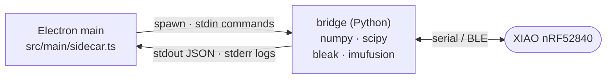

# PhysDAQ Desktop App

Electron + React front-end for the PhysDAQ wearable. It does not talk to the
hardware itself — it spawns **`scripts/bridge.py`** (the *sidecar*) as a child
process, one per connected sensor, and reads JSON lines from its stdout.



## Quick reference

```bash
npm install
npm run dev         # dev server with HMR (uses the repo's .venv for the bridge)
npm run typecheck
npm run build:win   # or build:mac / build:linux — builds the sidecar too
```

The dev build needs the repo's Python venv; see the setup steps in
[../docs/development.md](../docs/development.md).

## Full documentation

| | |
|---|---|
| Architecture, IPC surface, UI internals | [../docs/desktop-app.md](../docs/desktop-app.md) |
| Setup, build chain, packaging, troubleshooting | [../docs/development.md](../docs/development.md) |
| Bridge JSON and session CSV formats | [../docs/protocol.md](../docs/protocol.md) |
| Using the app | [../docs/user-guide.md](../docs/user-guide.md) |
