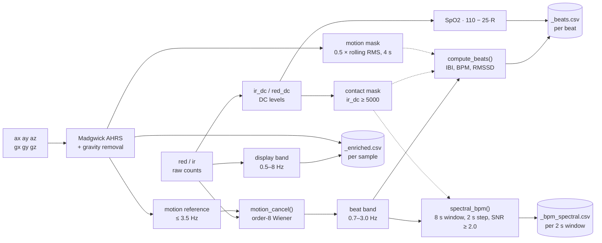

# Analysis Pipeline

Offline processing for recorded PhysDAQ data: filtering, motion cancellation,
orientation, beat detection, HRV and SpO2. Everything here is host-side Python
under `analysis/`.

There are three tools, meant to be used in order:

```bash
make log                              # 1. record  → logs/YYYY-MM-DD_HH-MM-SS.csv
make process FILE=logs/<file>.csv     # 2. process → *_enriched.csv, *_beats.csv
make explore FILE=logs/<file>.csv     # 3. inspect interactively
```

`make ble-log` does the same as `make log` over Bluetooth instead of USB.

---

## 1. `analysis/logger.py` — recording

Writes the raw stream to `logs/YYYY-MM-DD_HH-MM-SS.csv` with the header:

```
timestamp,red,ir,ax,ay,az,gx,gy,gz
```

`timestamp` is a float in seconds. Works over serial or BLE; BLE discovery is by
NUS service UUID, never by device name.

> **The logger records one channel of a hub.** Its regex mirrors the bridge's:
> the hub's `| PPG1 red=… ir=…` section is optional and its groups are dropped,
> because this CSV *is* the pipeline's single-channel input schema. `make log`
> against a hub therefore works, prints a one-line notice, and writes sensor 0
> only. Record from the desktop app to capture both of a hub's sensors.

---

## 2. `analysis/pipeline.py` — processing

Reads one logger CSV, writes three siblings next to it:

| Output | Contents |
|---|---|
| `<stem>_enriched.csv` | per-sample derived signals and orientation |
| `<stem>_beats.csv` | per-heartbeat metrics |
| `<stem>_bpm_spectral.csv` | sliding-window spectral heart rate |

**Enriched columns:** `red_filt`, `ir_filt`, `ir_clean`, `red_clean`, `red_dc`,
`ir_dc`, `roll_deg`, `pitch_deg`, `yaw_deg`, `qw`–`qz`, `accel_mag_g`, `motion`,
`contact`.

**Beat columns:** `beat_time`, `ibi_ms`, `bpm`, `rmssd_ms`, `spo2_pct`,
`motion_artifact`.

### Stages

1. **Band-pass / low-pass** the PPG channels.
2. **Contact mask** from the IR DC level.
3. **Madgwick AHRS** → quaternion and ZYX Euler angles in degrees.
4. **Gravity removal** → dynamic acceleration magnitude → motion mask.
5. **Motion cancellation** (`motion_cancel()`) — an order-8 per-axis
   least-squares (Wiener) regression that subtracts the accelerometer reference
   out of the PPG.
6. **Spectral BPM** (`spectral_bpm()`) — sliding 8 s window, 2 s step, FFT.
7. **Beat detection** (`compute_beats()`) → IBI, instantaneous BPM, RMSSD, SpO2.

Numbered as a list it reads linear, but the real shape branches: the PPG is
filtered **twice**, into two different bands for two different consumers, and the
DC levels bypass both.



### Why the parameters are what they are

The code comments carry most of this; the non-obvious choices:

**Two different PPG bands.** The display band is 0.5–8 Hz — 8 Hz preserves up to
the 6th harmonic at 80 BPM (1.33 Hz × 6), which is what gives a realistic pulse
*shape*. But those same harmonics plus the dicrotic notch create secondary peaks
that make `find_peaks` double-count beats. So beat detection uses a narrower
**0.7–3.0 Hz** (42–180 BPM) fundamental-only band, giving one clean peak per
cardiac cycle.

**Motion reference is band-limited to 3.5 Hz** so the regression removes motion
without eating cardiac harmonics.

**Adaptive peak height** — peaks must exceed 0.5 × rolling RMS over a 4 s window,
which handles contact quality drifting during a recording better than a fixed
threshold.

**IBI outlier rejection** — median filter over 5 beats, rejecting anything
±30 % off.

**Spectral BPM penalises motion** by scoring `ppg − 0.5 × accel` spectra, and
skips any window below `SPECTRAL_SNR_MIN = 2.0` or with under 50 % contact.

**No-contact data is dropped, not flagged.** Beats and spectral windows during
periods without skin contact are discarded entirely — an unworn sensor has no
physiological signal worth reporting.

**SpO2** uses the Mendelson ratio model, `110 − 25·R`. This is an uncalibrated
literature model on an uncalibrated sensor; treat the numbers as relative trends,
not clinical values.

---

## 3. `analysis/explore.py` — interactive viewer

A pyqtgraph viewer with linked pan/zoom across all signals. Point it at the
original logger CSV and it auto-discovers the `_enriched` and `_beats` siblings.

```bash
make explore FILE=logs/2026-06-15_10-49-03.csv
```

Requires `pyqtgraph`, `PyQt6` and `PyOpenGL` (all in `requirements.txt`).

---

## Live vs offline: two different DSP paths

The bridge that feeds the desktop app does **not** run this pipeline. It computes
a lighter real-time subset:

| | Bridge (live) | Pipeline (offline) |
|---|---|---|
| Orientation | imufusion AHRS + ZUPT | Madgwick |
| Heart rate | 8 s FFT window, parabolic sub-bin interpolation, rate-limited smoothing | Peak detection + sliding spectral estimate |
| PPG filter | single-sample EMA band-pass | 4th-order Butterworth, zero-phase |
| Motion cancellation | none | order-8 Wiener regression |
| SpO2 / HRV | not computed | computed |

The live path is deliberately cheap and causal; the offline path is zero-phase
and can look at the whole recording. Expect their BPM estimates to differ
slightly — the offline one is the reference.

### Yaw drift

There is no magnetometer on this board, so absolute heading is unobservable and
yaw drifts. The live bridge applies **ZUPT** (zero-velocity update): when
‖gyro‖ < 0.05 rad/s for 20 consecutive samples it zeroes the gyro input, which
suppresses drift while the node is still. This mitigates but does not eliminate
the problem. Roll and pitch are gravity-referenced and stay accurate.

---

## ⚠️ Known caveat: the app's CSVs are not pipeline input

`pipeline.py` calls `pd.read_csv(path).astype(float)` and expects the **logger**
schema (`timestamp,red,ir,ax…gz`, float timestamp).

Sessions recorded by the desktop app use a different schema — ISO-8601 string
timestamps, `ppg_red`/`ppg_ir` instead of `red`/`ir`, plus quaternion and BPM
columns. Feeding one to `make process` raises on the timestamp conversion.

**There is no converter in the repo yet.** For now, use `make log` when you
intend to run the offline pipeline, and the app's recorder when you want
multi-node sessions. See [roadmap.md](roadmap.md).

There is now a **third** format this pipeline cannot read: the hub's on-card
`.BIN` files (512-byte header, 16-byte records, documented in
[firmware-hub.md](firmware-hub.md#file-format)). The app can download them, but
nothing here parses them, so a downloaded session is currently a raw deliverable
rather than an input.
