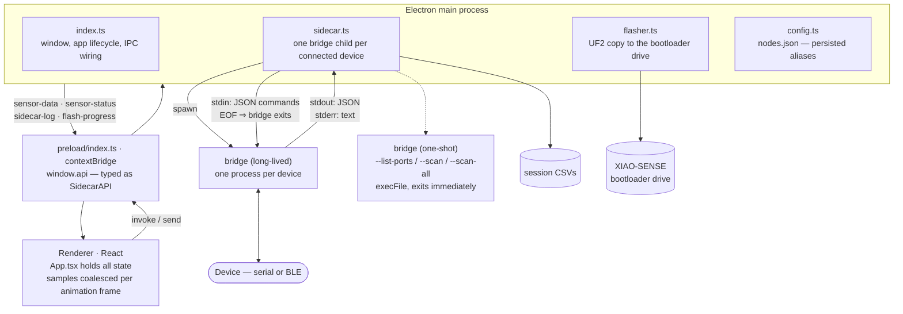
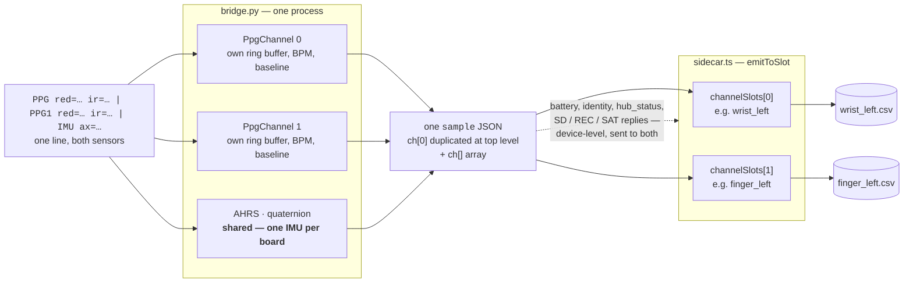

# Desktop App

`app/` is an Electron application that acquires from several PhysDAQ nodes at
once, plots them live, and records synchronised CSV sessions.

**Stack:** electron-vite 5 · Electron 39 · React 19 · TypeScript 5.9 ·
Tailwind v4 · shadcn/ui (new-york, Radix) · three.js · lucide-react.

It does **not** talk to hardware itself. All serial and BLE I/O happens in
`scripts/bridge.py`, which the main process spawns as a child — see
[protocol.md](protocol.md) for the JSON it emits.

---

## Process architecture

The one-shot query path is a different lifecycle from the per-device spawn: it
runs the same binary, prints one JSON array, and exits. Only the long-lived
processes are tracked.

One child process **per device**, tracked in
`activeSensors: Map<id, {process, mode, target, position, deviceType, channelSlots}>`.
A hub is one process feeding two body positions — see *Two slots per hub* below.

### How the bridge is located

`getBridgeInvocation()` in `sidecar.ts`:

| Build | Invocation |
|---|---|
| Development | `<repo>/.venv/Scripts/python.exe scripts/bridge.py` (or `.venv/bin/python`; falls back to bare `python` on PATH if neither venv exists) |
| Packaged | `<process.resourcesPath>/bridge/bridge[.exe]` — the PyInstaller bundle |

`getRepoRoot()` finds the repo by walking up from `app.getAppPath()` looking for
`scripts/bridge.py`, so the checkout can live anywhere and be named anything.

If the packaged binary is missing, the error names the expected path and tells
you to run `npm run build:sidecar` — a silent failure here is very hard to
diagnose otherwise.

### PYTHONPATH is stripped deliberately

`getPythonEnv()` removes `PYTHONPATH` and `PYTHONHOME` from the child's
environment. The Zephyr toolchain setup script (`scripts/setup-env.ps1`) points
both at the Nordic toolchain's Python, which breaks numpy's C extensions in the
venv. If you launch the app from a shell where you have sourced the Zephyr env,
this is what keeps it working.

---

## IPC surface

Exposed to the renderer as `window.api` through `contextBridge`; typed as
`SidecarAPI` in `app/src/preload/index.d.ts`.

| Channel | Kind | Payload → Result |
|---|---|---|
| `get-serial-ports` | `handle` | → `[{port, desc, hwid}]` |
| `scan-ble` | `handle` | `all?: boolean` → `[{address, name, rssi, deviceType, ppgCount, hasSd}]` — `scanBle()` renames the bridge's snake_case keys (see [protocol.md](protocol.md#bridge-invocation)); this is the only place the two conventions meet |
| `connect-sensor` | `on` | `{id, mode: 'serial'\|'ble', target, position, deviceType?, channelSlots?}` |
| `disconnect-sensor` | `on` | `id` |
| `disconnect-all` | `on` | — *(not exposed in preload; currently unreachable)* |
| `send-device-command` | `handle` | `(id, cmd)` → `{success, dest?, error?}` |
| `get-node-aliases` | `handle` | → `Record<target, alias>` |
| `set-node-alias` | `handle` | `(target, alias)` → updated map |
| `get-firmware-info` | `handle` | → `{node: FirmwareInfo, hub: FirmwareInfo}` |
| `get-bootloader-status` | `handle` | → `{present, drive?}` *(never called)* |
| `flash-node` | `handle` | `image: 'node'\|'hub'` → `{success, error?}` |
| `flash-progress` | `send` (M→R) | `{stage, message}` |
| `start-recording` | `handle` | `sessionName` → `{success, sessionPath?, error?}` |
| `stop-recording` | `handle` | → `{success, error?}` |
| `get-recordings` | `handle` | → session list |
| `get-recording-data` | `handle` | `(sessionPath, filename)` → `{success, data[]}` |
| `delete-recording` | `handle` | `sessionPath` → `{success}` |
| `sensor-data` | `send` (M→R) | one bridge JSON object + `sensorId`, `position`, `deviceId`, `deviceType`; sample messages also carry `channelIndex`, which is what drives the `HUB·S0` / `HUB·S1` markers |
| `sensor-status` | `send` (M→R) | `{sensorId, status, code?, error?}` |
| `sidecar-log` | `send` (M→R) | `{sensorId, log}` |
| `ping` | `on` | scaffold leftover, unused |

The four `on*` subscribers return unsubscribe closures.

### Device commands

`send-device-command` writes one JSON line to the bridge's stdin, which
translates it into the firmware's `CMD …` grammar. Replies come back as ordinary
`sensor-data` messages with their own `type`, so nothing in the main process has
to know about them — the stdout handler forwards any JSON object verbatim.

`sd.get` is the exception: the main process fills in the destination path
(`Documents/PhysDAQ_Sessions/hub_downloads/`) before forwarding, so the renderer
cannot choose where a file lands, and the bridge writes the megabytes to disk
directly rather than pumping them through IPC.

### Two slots per hub

`connect-sensor` takes `channelSlots`: one body-position slot per PPG channel.
A node passes one (its own id); a hub passes two. The stdout handler fans each
sample out per channel, flattening `ch[i]` to the top level so every slot
receives exactly the shape a single-PPG node would have produced.

That is what keeps everything downstream unchanged — charts, telemetry cards and
the 17-column session CSV all still see one PPG stream per slot.
`activeRecordings` is keyed on the **slot**, not the device, so a hub simply
writes two files. Device-level messages (battery, link status, SD and satellite
replies) go to both of a hub's slots, since both sit on one battery and one
link. `sidecar-log` fans out the same way: one bridge process has one stderr,
but each slot has its own System Logs pane, so both get every line.

End to end, one wire line becomes two CSV files:

Channel fields are flattened to the top level before the fan-out, so each slot
receives exactly the shape a single-PPG node would have produced. That is what
keeps the 17-column session CSV unchanged.

A hub connected **without** a second slot is allowed: `channelSlots` then holds
one entry and channel 1 is discarded on the host. The sensor is still acquired
and still logged to the hub's own card — it simply is not charted or written to
a session CSV. The connect dialog warns about this.

---

## Flashing

`flash-node` copies a UF2 to the board's bootloader drive. Four things about it
are non-obvious:

- **The bridge is disconnected first**, with an 800 ms wait for the OS to release
  the serial port. A locked port fails the copy.
- **The image follows the Device Type selector**, not any autodetect — both
  images run on the same board, so nothing on the drive says which one belongs
  there.
- **The drive is found by polling** every drive letter / mount point for an
  `INFO_UF2.TXT` containing `XIAO`, up to a 60 s deadline. That is the window in
  which the user double-taps RST.
- **A write error after the volume disappears counts as success.** The bootloader
  unmounts the drive the moment it accepts the image; that unmount is the only
  completion signal there is. Still mounted after ten retries is the failure.

Image sources are `build/zephyr/zephyr.uf2` and `build-hub/zephyr/zephyr.uf2` in
development, `<resourcesPath>/firmware/physdaq.uf2` and `physdaq-hub.uf2` when
packaged.

---

## Session storage

Recordings are written to `Documents/PhysDAQ_Sessions/`, one folder per session,
one CSV **per slot** — so a hub occupying two body positions writes two files. Schema in [protocol.md](protocol.md#3-app--disk-session-csv).

`get-recordings` scans **two** base directories and merges the results:
`PhysDAQ_Sessions` and the pre-rename `MAID_Sessions`. The legacy directory is
listed but never written to, so sessions recorded before the rename remain
readable. Entries from it carry `legacy: true`. Every entry returns an absolute
`path`, which is why `get-recording-data` and `delete-recording` need no
knowledge of which directory a session came from.

Session metadata is derived by parsing the folder name (`session_<date>_<name>`)
and reading the **last line** of each CSV for an approximate duration — no index
file is maintained.

`get-recording-data` parses by header index, tolerating missing columns, and
**backfills `ppg_filt`** if it is absent by recomputing the same EMA band-pass the
bridge uses (`dc = dc*0.985 + ir*0.015; lp = lp*0.75 + (ir−dc)*0.25`). This keeps
older recordings displayable.

> There is currently no export feature — no save dialog, no format conversion.
> Data leaves the app as the raw CSV files already on disk. See [roadmap.md](roadmap.md).

---

## Renderer

`App.tsx` is a single component holding all state, with three pages selected by
`currentPage` (no router).

### Sensor model

A fixed 8-slot constant, `SENSOR_POSITIONS`, each with SVG coordinates on the
body map: `head`, `chest`, `wrist_left`, `wrist_right`, `finger_left`,
`finger_right`, `ankle_left`, `ankle_right`. All default to BLE except `chest`,
which defaults to serial.

Each `SensorNode` carries `{status, battery{pct,mv}, bpm, contact, quat, ax…gz,
logs[]}` plus `{deviceType, deviceId, channelIndex}`; logs are capped at 50
entries, newest first. The slot map is built from `SENSOR_POSITIONS` rather than
written out eight times — it used to be eight ~250-character literals, and every
new field meant editing all of them.

Two slots sharing a `deviceId` are the two halves of one hub: same IMU, same
battery, same link, different PPG sensor. The inventory marks them `HUB·S0` /
`HUB·S1`.

`hubs: Record<deviceId, HubState>` holds what belongs to the box rather than to
either position — card status, session file list, download progress, satellite
roster. Listings stream in entry by entry and are swapped into the visible list
only on their terminator, so a listing cut short by a disconnect cannot be
mistaken for an empty card.

### Pages

**Body Network** — session recording controls (name, Record/Stop, `mm:ss` timer)
and a node inventory on the left; on the right an SVG human wireframe with 8
positioned markers. Marker colour encodes state: emerald = connected and worn,
amber = connected but not worn, primary = connecting, muted = disconnected.

**Node Detail** — three live charts (filtered PPG, raw red/IR, gyro), a three.js
board visualiser driven by the AHRS quaternion, and cards for heart rate, wear
status, battery and raw telemetry, plus a System Logs pane fed from the bridge's
stderr.

**Session Database** — saved sessions on the left; on the right a per-sensor file
selector and a timeline scrubber (draggable viewport over a downsampled
`ppg_filt` sparkline, with zoom, pan and numeric range inputs). The selected
range is downsampled to ≤1000 points and rendered by the same chart component in
static mode.

### Performance design

Two decisions that look like premature optimisation but are not — both fixed real
UI freezes:

**Sample coalescing.** Incoming samples land in `pendingSamplesRef` and are
flushed with **one `setSensors` per animation frame**. Calling `setState` per
sample at 100 Hz × N sensors let the IPC backlog snowball until the UI locked up.

**Charts bypass React entirely.** `RealTimeChart` pushes data into a plain ref
(`dataRef`, a 300-sample ring buffer) that its own `requestAnimationFrame` loop
reads from the canvas — no re-render per sample. Its config is carried through
`cfgRef` so the effect runs **once per mount**; rebuilding it per sample caused
canvas reallocation churn. Live data is only pushed when the detail page for that
exact sensor is open.

### Components

| File | Role |
|---|---|
| `components/RealTimeChart.tsx` | DPI-aware 2D-canvas plotter, own rAF loop, autoscale; used for both live and static plots |
| `components/BoardVisualizer.tsx` | three.js board model; parent group rotated −π/2 on X to map NWU (Z-up) to three.js Y-up; falls back to an idle spin on an identity quaternion |
| `components/HubStoragePanel.tsx` | hub card status, session file list, download / delete / erase, session start-stop |
| `components/HubSatellitesPanel.tsx` | hub satellite roster; carries the permanent banner saying ingestion is not implemented |
| `components/PhysDaqMark.tsx` | wordmark |
| `components/ui/*` | shadcn primitives (alert, button, card, combobox, dialog, input, select, separator) |
| `components/Versions.tsx` | unused electron-vite scaffold leftover |

Both hub panels render on **either** of a hub's two slots: they describe the
same device, and forcing the operator back to one particular body position to
reach the card would be arbitrary.

### Theme

`assets/main.css` defines a Tailwind v4 `@theme` block with a hardcoded
**Catppuccin Mocha** palette, plus the `animate-heartbeat` keyframes and custom
scrollbar styling.

---

## Building

See [development.md](development.md#packaging-the-desktop-app) for the full
sidecar + installer chain.
