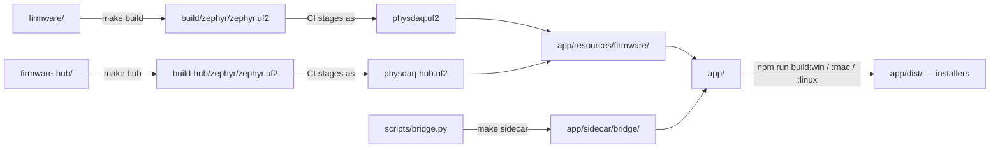
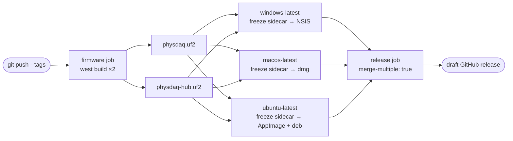

# Development Guide

How to set up a machine, build every part of PhysDAQ, and package a release.

---

## Repository layout

```
firmware/           Zephyr application (C) — single-PPG node
  src/              acquisition loop, drivers, power management, BLE
  boards/           DeviceTree overlay for xiao_ble_sense
  dts/bindings/     custom MAX30102 binding
  Kconfig, prj.conf project configuration
firmware-hub/       Zephyr application (C) — dual-PPG + microSD hub
  src/              per-sensor threads, storage, command channel, self-test
  boards/           overlay: I2C mux, two PPG nodes, SPI SD slot
app/                Electron desktop application
  src/main/         main process — spawns and supervises bridge instances
  src/preload/      contextBridge API surface
  src/renderer/     React UI
  resources/        firmware UF2s bundled into the installer
  scripts/          build-sidecar.mjs (npm → Python shim)
scripts/            bridge.py, build/flash helpers, live plotter, env setup
analysis/           CSV logger, offline pipeline, interactive explorer
assets/             logo SVGs, product renders, enclosure CAD (models/*.step)
hardware/enclosure/ enclosure design notes and print settings
docs/               this documentation
west.yml            Zephyr v3.6.0 version lock
requirements.txt    Python dependencies
```

Which directory produces what:



Not in git (all generated): `.west/`, `zephyr/`, `modules/`, `bootloader/`,
`tools/`, `build/`, `build-hub/`, `.venv/`, `app/node_modules/`, `app/out/`,
`app/dist/`, `app/sidecar/`, `app/resources/firmware/*.uf2`, `logs/*.csv`.

---

## Prerequisites

| Tool | How to get it |
|------|---------------|
| nRF Connect SDK v3.3.0 toolchain | `nrfutil` toolchain-manager (Windows) — see below |
| Zephyr SDK | Linux/macOS alternative to the above |
| west, CMake, Ninja, ARM GCC | Bundled with either toolchain |
| GNU Make | MinGW `make.exe` from the nRF toolchain, or Git Bash / MSYS2 |
| Python 3.10+ | For the venv (separate from the toolchain's Python). CI builds and ships on **3.12**, which is the only version the frozen sidecar is proven against. |
| Node.js 20+ and npm | For the desktop app. CI uses **20**. |

> **Two Pythons, kept apart.** The nRF toolchain ships its own Python and points
> `PYTHONPATH`/`PYTHONHOME` at it. The project's own dependencies (numpy, scipy,
> bleak, imufusion) live in a separate `.venv`. Do not `pip install` project
> dependencies into the toolchain Python. The Makefile and the desktop app both
> blank `PYTHONPATH` before invoking project scripts precisely so the two do not
> collide — this is why `make term` works even inside a Zephyr toolchain shell.

---

## First-time setup

### 1. Toolchain

**Windows** — install [nrfutil](https://www.nordicsemi.com/Products/Development-tools/nRF-Util),
then:

```powershell
nrfutil install toolchain-manager
nrfutil toolchain-manager install --ncs-version v3.3.0
```

> Newer `nrfutil` (verified on 8.2.0) also carries an `sdk-manager` group, and
> `nrfutil sdk-manager install v3.3.0` works — but it installs the nRF Connect
> SDK sources alongside the toolchain, and this repo is its own west workspace
> (`west.yml`, vendored `zephyr/` and `modules/`), so those sources are dead
> weight. Install the toolchain only, with the command above. `make env`,
> `scripts/setup-env.ps1` and this page all print that same form.

Open a toolchain shell (**required in every new terminal**):

```powershell
nrfutil toolchain-manager launch --terminal --ncs-version v3.3.0
```

or activate it in an existing PowerShell:

```powershell
. .\scripts\setup-env.ps1
```

> `setup-env.ps1` has the toolchain directory **hard-coded** to a specific hash
> (`C:
cs	oolchains\<hash>`). A different nRF Connect SDK install puts it
> elsewhere; edit the path at the top of the script rather than assuming the
> script is portable.

**Linux / macOS** — install the
[Zephyr SDK](https://docs.zephyrproject.org/latest/develop/toolchains/zephyr_sdk.html),
then:

```bash
source scripts/setup-env.sh
```

On macOS you will also want `brew install cmake ninja gperf ccache dtc`.

`make env` prints these hints from the terminal.

### 2. Zephyr workspace (once after clone)

```bash
make setup       # west init -l . && west update — downloads ~2–3 GB
```

### 3. Python virtual environment

```bash
python -m venv .venv

# Windows
.venv/Scripts/python -m pip install -r requirements.txt
# Linux / macOS
.venv/bin/python -m pip install -r requirements.txt
```

The Makefile auto-detects `.venv` with a pure-Make `wildcard` check (no shell
involved, so it works identically on all three platforms) and falls back to
system `python` if there is none.

### 4. Node modules (desktop app only)

```bash
cd app && npm install
```

---

## Daily workflow

### Firmware

```bash
make build      # incremental compile → build/zephyr/zephyr.uf2
make rebuild    # pristine — required after overlay / DTS / Kconfig changes
make flash      # double-tap RST, then copy the UF2 to the XIAO-SENSE drive
make term       # serial console @115200, port auto-detected
make clean      # remove build/
```

The hub firmware is a separate application with its own build directory, so the
two coexist instead of pristine-rebuilding each other on every switch:

```bash
make hub          # incremental → build-hub/zephyr/zephyr.uf2
make hub-rebuild  # pristine
make hub-flash    # same bootloader drive, different image
make hub-clean    # remove build-hub/
```

Both images run on the same board — nothing on the drive records which one is
loaded, so keep track of what you flashed. See
[firmware-hub.md](firmware-hub.md).

### Desktop app

```bash
cd app
npm run dev         # electron-vite dev server with HMR
npm run typecheck   # tsc over both the node and web configs
npm run lint
npm run format
```

`npm run dev` uses the repo `.venv` for the bridge, so firmware changes and app
changes can be iterated together without repackaging anything.

### Data tooling

```bash
make log                              # record a CSV (serial)
make ble-log                          # record over BLE
make ble-log ADDR=E1:23:45:67:89:AB   # …a specific device
make plot / make ble-plot             # live pyqtgraph dashboard + 3D orientation
make process FILE=logs/<file>.csv     # offline pipeline
make explore FILE=logs/<file>.csv     # interactive viewer
make icons                            # regenerate app icons from the source SVG
```

> `make log` and `make plot` parse the **single-PPG** line format. A hub's line
> carries a second sensor and does not match the logger's stricter regex, so it
> records a header and no rows, silently. See [analysis.md](analysis.md).

`make help` lists everything.

---

## Packaging the desktop app

Two artefacts have to be built, in order: the frozen Python sidecar, then the
Electron installer.

```bash
make sidecar                  # freeze scripts/bridge.py → app/sidecar/bridge/
make sidecar CLEAN=1          # …discarding the previous bundle first
cd app && npm run build:win   # or build:mac / build:linux
```

`npm run build:win` runs typecheck → `electron-vite build` → `build:sidecar` →
`electron-builder`, so the one command is enough from a clean tree.

Equivalent ways to build just the sidecar:

```bash
npm run build:sidecar              # from app/
python scripts/build-sidecar.py    # from the repo root
make sidecar                       # ditto, uses the repo venv automatically
```

### How the chain fits together

```
app/package.json  build:sidecar
   └─► app/scripts/build-sidecar.mjs     picks .venv python, strips PYTHONPATH
        └─► scripts/build-sidecar.py     runs PyInstaller, then smoke-tests
             └─► scripts/bridge.spec     the actual bundle definition
                  └─► app/sidecar/bridge/bridge.exe + _internal/
```

`electron-builder.yml` then copies `sidecar/bridge` into the installer as
`resources/bridge/`, **outside** the asar archive — the OS cannot execute a file
from inside an archive. That path is what `getBridgeInvocation()` looks for at
runtime.

`build-sidecar.py` runs the frozen binary once (`--list-ports` as a hard check,
`--scan-all` as a soft one, since a missing Bluetooth adapter is not a bundle
defect). It is deliberately not `--scan`: the filtered scan legitimately returns
`[]` when no node is powered on, which would prove nothing about the BLE backend
before declaring success. A missing hidden import therefore fails at build time
rather than silently inside the installed app.

The result — `dist/physdaq-<version>-setup.exe`, currently 1.2.0 — runs on a machine with **no Python,
no venv and no pip installs**. It is roughly 130 MB larger than a bare Electron
build because numpy, scipy and the WinRT Bluetooth bindings travel with it.

> **PyInstaller does not cross-compile.** A Windows `.exe` must be built on
> Windows, a macOS bundle on macOS, a Linux binary on Linux. To ship all three,
> run the matching `build:*` script on each platform.

### `bridge.spec` notes

The bleak backend is collected per platform, because WinRT namespace packages
with native `.pyd` files do not survive PyInstaller's static analysis:

- **Windows** — `collect_submodules('bleak.backends.winrt')` plus `collect_all`
  on `winrt` and eight `winrt.windows.*` namespace packages.
- **macOS** — corebluetooth backend, `CoreBluetooth`, `objc`.
- **Linux** — bluezdbus backend, `dbus_fast`.

PyQt, pyqtgraph, matplotlib, pandas, tkinter, IPython and pytest are explicitly
**excluded** — they are only used by the analysis tooling, not the bridge, and
they would roughly double the bundle.

---

## Releasing

The cross-compilation limit above is the whole reason there is a CI pipeline:
shipping three platforms from one machine is impossible, so
[`.github/workflows/release.yml`](../.github/workflows/release.yml) runs the
same `build:*` scripts on a Windows, a macOS and a Linux runner in parallel, and
each one freezes its own sidecar.

To cut a release:

```bash
# 1. bump the version in all three places that have to agree:
#      app/package.json      — the release job refuses a tag that disagrees
#      firmware/src/version.h, firmware-hub/src/version.h — the ID line and
#      the session-file header, which is how a recording names its build
git commit -am "chore: release v1.2.0"
git tag v1.2.0
git push && git push --tags
```

The shape is a fan-out and a fan-in:



CI then attaches six files to a **draft** release — the four installers plus both
firmware images, since the release job downloads every artifact and the `firmware`
artifact's `.uf2` files come along with them:

| Platform | Artifact |
|---|---|
| Windows | `physdaq-<version>-setup.exe` (NSIS installer) |
| macOS (Apple Silicon) | `physdaq-<version>-arm64.dmg` |
| Linux | `physdaq-<version>-x86_64.AppImage` and a `.deb` |
| Firmware | `physdaq.uf2`, `physdaq-hub.uf2` |

Review the artifact list, then publish the draft from the GitHub Releases page.
The tag must match `app/package.json`'s `version` or the release job fails on
purpose — a release labelled `v1.1.0` full of `1.0.0` artifacts is worse than no
release. `workflow_dispatch` runs the same matrix without creating a release,
which is the way to test a pipeline change.

A `firmware` job builds **both** images once — `firmware/` into `build/` and
`firmware-hub/` into `build-hub/` — and hands them to all three app jobs, which
stage them at `app/resources/firmware/physdaq.uf2` and `physdaq-hub.uf2` before
electron-builder packages them as `extraResources`. That is what lets the
installed app flash either board without a toolchain
(`app/src/main/flasher.ts`). The images are hardware-specific rather than
host-specific, so they are built once rather than per-OS, and they are also
attached to the release for anyone who wants to flash by hand.

`*.uf2` is gitignored, so a **local** `npm run build:*` bundles whatever happens
to be sitting in `app/resources/firmware/` — nothing, on a fresh clone, in which
case the app's flash button reports itself unavailable. Only CI ships images
reproducibly. In development the flasher instead uses the matching build
directory (`build/` for a node, `build-hub/` for a hub), so `make build` or
`make hub` then `npm run dev` flashes what you just compiled.

**What CI deliberately does not do:**

- **No code signing, no notarization.** There are no certificates in this repo.
  Windows shows a SmartScreen warning, macOS Gatekeeper refuses a double-click.
  Both are documented for end users in [user-guide.md](user-guide.md).
  Signing would mean adding `CSC_LINK`/`CSC_KEY_PASSWORD` (Windows) or
  `APPLE_ID`/`APPLE_TEAM_ID`/`APPLE_APP_SPECIFIC_PASSWORD` plus `notarize: true`
  (macOS) as repository secrets.
- **No auto-update.** There is no `publish` block in `electron-builder.yml` and
  no update feed; users download a new installer.
- **No Intel macOS build.** Only `arm64`. Artifact names carry `${arch}`, so
  adding a `macos-13` leg to the matrix would not collide.
- **No snap.** It needs snapcraft and lxd on the runner and breaks far more
  often than the AppImage.

To build one platform by hand instead, run `make sidecar` then the matching
`npm run build:*` on that platform — `build-sidecar.py` discards a bundle left
over from a different OS before it starts, so a stale `bridge.exe` cannot end up
inside a Linux package.

---

## Conventions

- **Line endings** are normalised to LF via `.gitattributes`, except `.ps1`/`.bat`
  (CRLF) and CAD binaries under `hardware/` (`binary`, never normalised).
- **Firmware comments** explain *why*, not *what* — several non-obvious choices
  (FIFO rollover, watchdog sleep options, the reverted heartbeat-validated
  contact check) are documented in-source and should stay that way.
- **No test suite exists** in any layer. See [roadmap.md](roadmap.md).

---

## Troubleshooting

| Symptom | Cause | Fix |
|---|---|---|
| `west: command not found` | Toolchain not activated | Open a toolchain shell, or source the setup script |
| `west: unknown command 'build'` | Not inside a west workspace | `make setup` |
| `CMake Error: … C:/ncs/… pristine.cmake` | Stale build cache from another workspace | `make clean && make build` (the build wrapper also auto-detects this) |
| `No board named 'xiao_ble_sense'` | Wrong board name | Use `xiao_ble_sense` — not `xiao_ble/nrf52840/sense`, which is a later Zephyr naming scheme |
| Kconfig symbol changes have no effect | Incremental build reused the old config | `make rebuild` |
| `XIAO-SENSE drive not found` | Bootloader not active | Double-tap RST before `make flash` |
| `ImportError` / `python312.dll conflicts` | Mixed toolchain and project Python | Run through the Makefile, which blanks `PYTHONPATH` |
| `No module named 'serial'` / `numpy` | venv missing or not used | Recreate `.venv` and `pip install -r requirements.txt` |
| App: *"Python sidecar not found at …"* | Packaged without the sidecar | `npm run build:sidecar`, then rebuild |
| Sidecar exits with `ModuleNotFoundError` | PyInstaller missed a dynamic import | Add it to `hiddenimports` in `scripts/bridge.spec`, rebuild with `make sidecar CLEAN=1` |
| Antivirus / SmartScreen flags the installer | Unsigned PyInstaller binary | Expected; code-sign via `win.certificateFile` if distributing widely |
| Serial port vanished | Node entered deep sleep | Move it to wake it, then reconnect — the USB CDC port is recreated |
