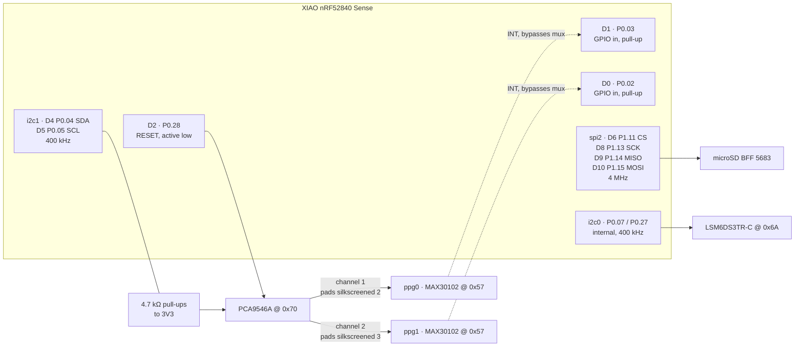
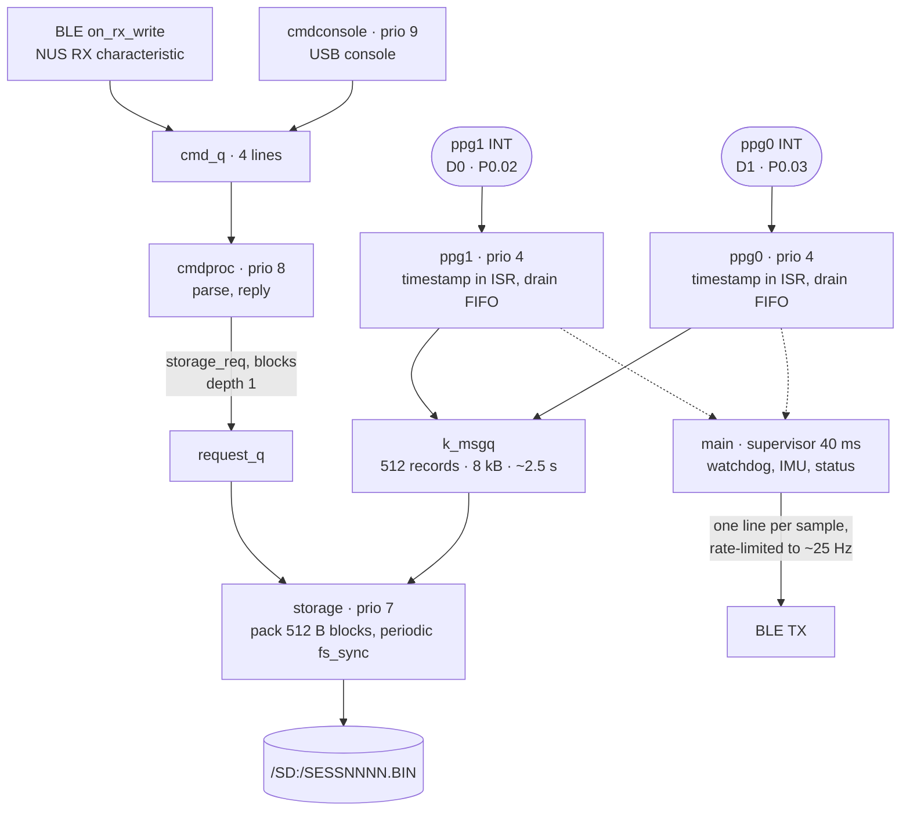

# Firmware — Hub node (`firmware-hub/`)

Dual-PPG acquisition node that logs to microSD. Copied from
[`firmware/`](../firmware/) (the single-PPG node) and adapted; the MAX30102
register sequences are carried over verbatim.

This is the **prototype track** — off-the-shelf modules on breadboard. The
custom PCB track (MAX86178 / ICM-20948 / BQ25120A) is out of scope here.

Phase 1 (this document) acquires two local PPG streams and writes them to the
card. Phase 2 turns the same device into a hub that also ingests remote
single-PPG nodes over the radio — designed for, not implemented.

---

## Hardware

| Part | Detail |
|---|---|
| MCU | Seeed XIAO nRF52840 Sense — Zephyr board `xiao_ble_sense` |
| IMU | onboard LSM6DS3TR-C @ 0x6A, internal I2C bus |
| Mux | PCA9546A @ 0x70 (A0/A1/A2 to GND) |
| PPG | 2× MAXREFDES117# (MAX30102), both strapped to 0x57 |
| Storage | Adafruit microSD BFF (5683), discrete jumpers, SPI |

### Pin map

Sensors are named `ppg0` and `ppg1` throughout, matching the DeviceTree
labels in `firmware-hub/boards/xiao_ble_sense.overlay` and the `PPG_SRC_LOCAL_0`
/ `PPG_SRC_LOCAL_1` source IDs written into every record. Avoid "#1 / #2" — the
off-by-one against the zero-based source IDs is how the INT pairing below got
documented backwards once already.

| XIAO | nRF52840 | Function |
|---|---|---|
| D0 | P0.02 | INT, `ppg1` (mux channel 2) |
| D1 | P0.03 | INT, `ppg0` (mux channel 1) |
| D2 | P0.28 | PCA9546A RESET (active low) |
| D3 | P0.29 | reserved — future load switch on the PPG supply rail |
| D4 | P0.04 | I2C SDA (upstream) |
| D5 | P0.05 | I2C SCL (upstream) |
| D6 | P1.11 | SPI CS, microSD |
| D7 | P1.12 | unused |
| D8 | P1.13 | SPI SCK |
| D9 | P1.14 | SPI MISO |
| D10 | P1.15 | SPI MOSI |

### Bus topology

The upstream I2C bus is **`i2c1` (D4/D5) at 400 kHz**, with the PCA9546A at
0x70. `ppg0` is on mux **channel index 1**, `ppg1` on **channel index 2**;
indices 0 and 3 are unused and unpopulated.

> **Channel indices are not the breakout's pad labels.** The hand-off report
> says channels 2 and 3 because that is what the silk screen reads, but this
> breakout numbers its pads 1-4 while the part numbers its channels 0-3. The
> pads marked `SD2/SC2` and `SD3/SC3` are indices 1 and 2. Measured, not
> assumed — the boot self-test walks all four channels and prints which ones
> answer at 0x57. If you swap the breakout, re-run it and believe its output
> over the labels.

> **`i2c0` is the internal IMU bus, `i2c1` is the exposed one.** The hand-off
> report has these the other way round. Verified against the board files:
> `xiao_ble-pinctrl.dtsi` maps `i2c0` to P0.07/P0.27 — where `xiao_ble_sense.dts`
> places the LSM6DS3TR-C — and `i2c1` to P0.04/P0.05, which
> `seeed_xiao_connector.dtsi` aliases as `xiao_i2c`. The physical pins in the
> report are right; only the peripheral labels were swapped.

The two **INT lines bypass the mux** and land on plain GPIOs. That is what lets
a sample-ready event be timestamped the instant it fires, independently of which
mux channel happens to be selected. Do not route them through the mux.

### Wiring

Both PPG modules answer at 0x57 and the address is not strappable — that is the
only reason the mux exists. Note that each sensor's INT line and its mux channel
are **independent facts**: the wire pairing was measured by the boot self-test,
not inferred from the channel number, and pairing them wrong still acquires
cleanly with every timestamp attributed to the wrong body site.



3V3 and GND run from the XIAO to the mux, both PPG modules and the microSD
breakout. The PPG modules have no enable pin — low power is `MODE_CONFIG = 0x80`
(SHDN) over I2C, so the supply rail is always live. D3 / P0.29 is reserved for a
future load switch on that rail and has no DeviceTree node today.

---

## Invariants — do not break these

- **`uart0` must stay disabled.** It claims P1.11 in the board devicetree, and
  P1.11 is now the SD chip select. Two peripherals on one pad is a silent
  failure. The console is USB CDC ACM, so nothing is lost.
- **`spi2` is overridden to `nordic,nrf-spim`.** The board declares plain
  `nordic,nrf-spi`, which services a 512-byte block one byte-interrupt at a
  time and would contend with the two PPG interrupts. EasyDMA keeps the
  acquisition ISRs clean.
- **`CONFIG_I2C_TCA954X_CHANNEL_INIT_PRIO` must exceed `..._ROOT_INIT_PRIO`.**
  Both default to `I2C_INIT_PRIORITY` in Zephyr 3.6 while the driver carries a
  `BUILD_ASSERT` demanding they differ — the upstream defaults do not compile.
  Set to 51 and 50 in `prj.conf`.
- **The MAX30102 FIFO rollover stays enabled** (`FIFO_CFG = 0x10`), same as the
  single-PPG node. With it off the FIFO wedges permanently the first time the
  host falls behind.
- **Timestamps are captured in the GPIO ISR**, never after the mux switch or
  the FIFO read. See *Timing* below.
- **Deep sleep is off** (`CONFIG_PHYSDAQ_DEEP_SLEEP=n`). A hub records
  unattended and is routinely stationary and unworn — exactly the state the
  idle timer reads as "put down".
- **`storage_init()` must run before `ppg_init()`.** It anchors the session
  clock, and the acquisition threads read that epoch once at start-up.
- **The file system has exactly one owner: the storage thread.** Every command
  that touches the card goes through `storage_*()`, which posts a request and
  blocks. FATFS is not reentrant across a volume, and a second thread calling
  `fs_*` would race the writer holding the session file open.
- **Nothing on either stream may start with `PPG` except the sample line.**
  `bridge.py` discards unmatched lines beginning with those three characters, so
  a status line or command reply prefixed that way would vanish silently. This
  is why they read `Hub:`, `SD`, `REC`, `SAT`, `ID`.

---

## Architecture

| File | Responsibility |
|---|---|
| `main.c` | Init order, supervisor loop, IMU, BLE line formatting, status line, periodic diagnostics |
| `ppg.c/.h` | One acquisition thread per sensor; ISR timestamping, FIFO drain, record enqueue |
| `storage.c/.h` | The only file-system owner: session files, block packing, `fs_sync`, maintenance requests |
| `command.c/.h` | Host command grammar, reply formatting, base64 download |
| `satellites.c/.h` | NVS-backed roster of up to 8 remote nodes — configuration only |
| `selftest.c/.h` | Boot and periodic bus diagnostics — see below |
| `max30102.c/.h` | Register-level driver, shared by both sensor threads |
| `ble.c/.h`, `power.c/.h`, `battery.c/.h`, `watchdog.c/.h`, `imu.c/.h`, `led.c/.h` | As on the single-PPG node, with the divergences noted here |
| `version.h` | `PHYSDAQ_FW_STRING`, shared by the `ID` line and `hdr.fw_version` |

Five threads plus the supervisor:

| Thread | Prio | Stack | Role |
|---|---|---|---|
| `ppg0`, `ppg1` | 4 | 1536 | one per sensor: wait on INT, drain FIFO, timestamp, enqueue |
| `storage` | 7 | 4096 | dequeue, pack into 512 B blocks, write, periodic `fs_sync()`, service maintenance requests |
| `cmdproc` | 8 | 3072 | parse host commands, reply |
| `cmdconsole` | 9 | 1024 | read the USB console, feed `cmdproc` |
| `main` | — | 2048 | watchdog, IMU, BLE stream, status lines; supervisor turns over every 40 ms |

Acquisition outranks storage deliberately: an SD card doing internal
wear-levelling can block a write for tens of milliseconds, and that must never
delay a FIFO drain. The `k_msgq` between them holds 512 records (8 kB), about
2.5 s of headroom at 200 records/s. `records_dropped` in the status line is the
check that it was enough — it should be zero, always.

The command threads sit *below* storage, which is the same reasoning one rung
down: nothing a human triggers is time-critical, and a queued command must never
be the reason a card write is late.

Bus arbitration is handled entirely by Zephyr's `tca954x` driver, which
serialises (channel select + transfer) under its own mutex. **Do not add a
second layer of locking.**

Two planes run through those threads, and they meet only at the storage thread:



**Only the storage thread touches the file system.** Commands post a request and
block on the reply — FATFS is not reentrant across a volume, and the storage
thread holds the session file open. Enqueueing times out after 2 s, completion
after 10 s.

### Bus self-test

`selftest.c` runs at boot and then every 10 s **while not acquiring** — it drives
the mux registers directly, behind the `tca954x` driver's back, which is only
safe when no acquisition thread is mid-transfer. Never relax that gate.

What it establishes, in order:

1. **Idle SDA/SCL levels**, read straight off the pads. Both low means no
   pull-ups (or a short); this is the one failure the address probe cannot
   distinguish from an empty bus.
2. **RESET pulse and pad readback** on D2. It cannot prove the mux saw the
   pulse — only that the MCU drove it.
3. **A full 0x08–0x77 scan**, by 1-byte read rather than a zero-length write:
   some parts NACK the address-only form even when present.
4. **A four-channel walk**, confirming 0x57 both *appears* on the enabled
   channel and *disappears* on the others. Appearing alone would not rule out
   a stuck-open mux.
5. **The INT ↔ channel pairing**, by quiescing both sensors, enabling one, and
   watching which line falls. This is the only way to learn the pairing — it is
   wiring, not addressing, and getting it wrong still produces clean data
   attributed to the wrong body site.

Believe its output over the breakout's silk screen.

### Failure handling

- **Per-sensor stall recovery.** If a sensor produces nothing for 1 s, its own
  thread re-runs init. One dead sensor cannot take the other down, and the
  session file stays open.
- **Watchdog scope changed** from the single-PPG firmware: it now guards the
  supervisor loop, not acquisition. Resetting the SoC over a wedged sensor
  would close the session file, which is worse than the wedge. Otherwise the
  configuration is the node's: `wdt0`, 8 s, `WDT_FLAG_RESET_SOC`,
  `WDT_OPT_PAUSE_HALTED_BY_DBG`, and deliberately **not**
  `WDT_OPT_PAUSE_IN_SLEEP`.
- **Fatal errors reboot, and are reported.** `crashlog.c` overrides the fatal
  handler (noinit-RAM record + immediate reboot) exactly as on the node; the
  default halt left the hub silent for 8 s until the watchdog fired.
- **A missing card is not fatal.** Acquisition still runs and streams over BLE;
  the boot banner says `Storage: UNAVAILABLE` loudly.
- **Sleep closes the session file.** `power.c` calls `storage_close()` before
  System Off. Deep sleep is disabled on the hub today, so this is insurance for
  the day it is not.

---

## Timing

Single monotonic source for both sensors: **`k_uptime_ticks()`**, the 32768 Hz
RTC on nRF52 (`CONFIG_SYS_CLOCK_TICKS_PER_SEC = 32768` — that is the symbol
`k_uptime_ticks()` and `hdr.tick_hz` follow; `..._HW_CYCLES_PER_SEC` happens to
carry the same value and is not the one to override). Resolution
**30.5 µs**; 64-bit, so it never wraps.

30.5 µs is 0.3 % of a 10 ms sample period, comfortably below the MAX30102's own
sample jitter and its 411 µs LED pulse width. `k_cycle_get_32()` has the same
resolution but wraps every ~36 h, which is why it is not used.

Two correctness details that are easy to get wrong and invisible in testing:

1. **`isr_ticks` is read under `irq_lock()`.** It is a `uint64_t` written from
   interrupt context; a Cortex-M4 loads it as two 32-bit accesses, and an
   interrupt landing between them yields a value that never existed — off by
   2^32 ticks (~36 h) near a low-word rollover.
2. **The timestamp is paired with the FIFO write pointer under a seqlock-style
   retry.** Reading the pointers takes a few hundred microseconds; an interrupt
   landing inside that window advances the write pointer *after* the timestamp
   was taken, so the batch would contain one sample newer than the timestamp
   applied to it — dating the newest sample a full ODR period early.

### Batch back-dating

The FIFO is read in bulk, so the interrupt belongs to the **newest** entry.
Older entries are back-dated from the ODR, computed as a single 64-bit
multiply-then-divide so the rounding error stays under one tick across the
batch instead of compounding. Every back-dated record carries
`PPG_FLAG_BACKDATED`, so an offline reader can always tell a measured timestamp
from a derived one.

---

## File format

`/SD:/SESSNNNN.BIN` — one 512-byte header, then a stream of 16-byte records.
Little-endian throughout. Binary only; convert offline.

16 bytes means 32 records make exactly one 512-byte SD block, and the header
occupies one block on its own, so steady-state writes are block-aligned.

### Header (512 B)

| Offset | Type | Field |
|---|---|---|
| 0 | char[8] | `MAIDLOG1`, not NUL-terminated |
| 8 | u16 | `header_size` = 512 |
| 10 | u16 | `record_size` = 16 |
| 12 | u16 | `format_version` = 1 |
| 14 | u16 | `odr_hz`, per sensor |
| 16 | u32 | `session_id` — the NNNN in the filename |
| 20 | u32 | `tick_hz` = 32768 |
| 24 | u64 | `epoch_ticks` — absolute tick count at session open |
| 32 | u8 | `led_pa` — LED pulse amplitude register (0x1F ≈ 6.2 mA) |
| 33 | u8 | `spo2_cfg` — SPO2_CONFIG register (0x67 at 100 Hz) |
| 34 | u8 | `src_count` |
| 35 | u8 | reserved |
| 36 | u8[8] | `src_mux_ch[i]` = mux channel index for source i, `0xFF` if not local |
| 44 | u8[4] | `fw_version` — major, minor, patch, tweak |
| 48 | u8[464] | reserved |

Read `header_size` and seek by it. Do not assume `sizeof(struct)`.

### Record (16 B)

| Offset | Type | Field |
|---|---|---|
| 0 | u8 | `source_id` |
| 1 | u8 | `flags` |
| 2 | u16 | `seq` — per source, wraps at 65536 |
| 4 | u32 | `t_ticks` — ticks since `epoch_ticks` |
| 8 | u32 | `red` — raw 18-bit count, zero-extended |
| 12 | u32 | `ir` |

**Source IDs.** `0x00`–`0x0F` are sensors physically on this board. Which mux
channel each one sits on is recorded per-file in `src_mux_ch`, derived from the
devicetree rather than hardcoded — the mapping has already moved once and a
header that disagreed with the overlay would mislabel every recording made with
it. `0x10`+ is reserved for remote nodes ingested over the radio in Phase 2. The field is wide enough that node identification can be
assigned later without a format change.

**Flags.**

| Bit | Name | Meaning |
|---|---|---|
| 0 | `BACKDATED` | timestamp derived from the ODR, not an interrupt capture |
| 1 | `OVERFLOW` | the part dropped samples; there is a gap immediately before this record |
| 2 | `UNTIMED` | recovered on the poll-timeout path; treat the timestamp as approximate |

**Absolute time** of a record is `epoch_ticks + t_ticks`, in units of
`1/tick_hz` seconds. `t_ticks` is 32-bit at 32768 Hz, so a single session can
run ~36 h before it would wrap.

**Sample loss** is detectable two ways: a `seq` discontinuity (records dropped
between the sensor and the card) and the `OVERFLOW` flag (samples the sensor
itself discarded because the firmware fell behind).

### Durability

`fs_sync()` runs at least every `CONFIG_PHYSDAQ_SD_SYNC_INTERVAL_MS`
(default **1000 ms**), and any partially filled block is pushed out first. An
ungraceful power loss therefore costs **at most one second** — roughly 200
samples, 3.2 kB, at two sensors and 100 Hz.

> Not yet wired into the offline pipeline. `analysis/pipeline.py` reads the
> logger's CSV and knows nothing about this format; a reader has to be written.
> See [roadmap.md](roadmap.md).

---

## Configuration

| Symbol | Default | Notes |
|---|---|---|
| `PHYSDAQ_PPG_ODR_HZ` | 100 | 50 / 100 / 200 / 400 only. 100 is the validated rate; higher is unproven on this hardware |
| `PHYSDAQ_SD_SYNC_INTERVAL_MS` | 1000 | upper bound on data lost to a power cut |
| `PHYSDAQ_DEEP_SLEEP` | `n` | off on the hub — see Invariants |
| `PHYSDAQ_IDLE_TIMEOUT_SEC` | 10 | only acts when deep sleep is enabled |

`PHYSDAQ_PPG_ODR_HZ` accepts 50 / 100 / 200 / 400 only because it is compiled
into the MAX30102's `SPO2_CFG` sample-rate field: `0x60 | (SR << 2) | 0x03`, with
`SR` chosen by a lookup in `max30102.h` and an `#error` on anything else. A
`BUILD_ASSERT` pins the 100 Hz case to the validated `0x67`, so a change to the
derivation that silently altered the default fails the build.

Beyond the PhysDAQ symbols, `prj.conf` carries blocks the node does not need:
the `tca954x` mux driver (with the init priorities pinned in *Invariants*), the
SPI / SDHC / FATFS stack, `CONSOLE_SUBSYS` + `CONSOLE_GETCHAR` for the command
channel, `BASE64` for downloads, and NVS for the satellite roster.

> **Temporary:** the SD debug-logging block (`LOG_MODE_MINIMAL`,
> `SDHC_LOG_LEVEL_DBG`, `SD_LOG_LEVEL_DBG`) is still enabled, and is marked in
> `prj.conf` for removal once the card mounts reliably. It costs flash and
> console bandwidth; drop it when bring-up step 4 passes.

---

## Build

```bash
make hub          # incremental
make hub-rebuild  # pristine — after overlay or Kconfig changes
make hub-flash    # UF2 to the XIAO-SENSE bootloader drive
```

Builds into `build-hub/`, separate from the single-PPG firmware's `build/`, so
the two coexist. A Zephyr toolchain must be active — see
[development.md](development.md).

---

## BLE

The hub advertises the NUS service exactly like a single-PPG node, so the
service-UUID discovery filter is unchanged. It additionally puts a
manufacturer-specific AD field on the wire carrying the device class, and emits
an `ID` line on both transports — see [protocol.md](protocol.md) for both.

The per-sample line carries **both** sensors, and stays a superset of the
single-PPG format:

```
PPG red=… ir=… | PPG1 red=… ir=… | IMU ax=… ay=… az=… gx=… gy=… gz=…
```

One line, not two, and the `PPG red=` prefix is load-bearing: `bridge.py`
matches with `re.search`, so an un-updated bridge still parses sensor 0 out of
this line, whereas a *separate* line beginning `PPG1` would be silently dropped
(the parser discards any unmatched line starting with `PPG`). Keeping the pair
in one message also gives them a single arrival timestamp on the host.

A `Hub:` status line every 5 s carries the rest — per-sensor counts, overflow
and reinit counters, and storage statistics.

Still rate-limited to ~25 Hz. The link carries ~4 kB/s; the raw two-sensor
stream is several times that and would overflow the TX queue.

The transmit path is the node's, verbatim: `ble_send()` only queues, a dedicated
TX thread is the only caller of `bt_gatt_notify()` (which blocks with `K_FOREVER`
on buffer exhaustion — see [firmware.md](firmware.md#blec)), the controller runs
Data Length Extension, and the connection-parameter auto-update is off. The
`ID` line is followed by the same boot report (`Boot:` / `Crash:` / `Hang:`),
emitted from `command_send_identity()`; `crashlog.c` owns the reset cause here.

---

## Bring-up status

Per the hand-off report's checklist, against the physical prototype.

| # | Step | Status |
|---|---|---|
| 1 | I2C scan — only 0x70 answers | **pass** |
| 2 | Mux channel toggle, all four channels walked | **pass** — indices 1 and 2 populated |
| 3 | Part ID 0x15 on each channel | **pass** |
| 3b | INT line ↔ channel pairing verified | implemented in `selftest.c`, not yet run on hardware |
| 4 | Mount FAT, write and read back a test file | **fails at CMD0** — SPI wiring |
| 5 | Single-sensor logging, plausible waveform | acquires at ~100.5 Hz, `ovf=0`, `ri=0`; blocked on 4 for the logging half |
| 6 | Dual-sensor logging, no loss, no drift | pending |
| 7 | Multi-hour endurance run | pending |

---

## Command channel

The host can drive the hub over the same link it streams on — BLE RX
characteristic `6e400002-…`, or the USB console. `src/command.c` owns both.
The full grammar is in [protocol.md](protocol.md#1b-host--device-the-command-channel);
what matters here is how it stays out of acquisition's way.

- **Nothing parses in the BLE callback.** `on_rx_write()` hands bytes to
  `command_feed()`, which assembles lines under a spinlock and queues complete
  ones. File I/O there would stall the radio behind a card doing wear-levelling.
- **File system work happens on the storage thread**, between whole loop
  iterations, never mid-block. Response latency is therefore bounded by
  `CONFIG_PHYSDAQ_SD_SYNC_INTERVAL_MS` in the worst case — fine for something a
  human clicked, and not worth restructuring a timing-critical loop to improve.
- **`sd.abort` is recognised during line assembly**, not by the dispatcher. A
  download runs *inside* the command thread, so an abort routed the normal way
  could only be read once there was nothing left to abort.
- **Downloads yield between chunks.** Without that, a transfer holds the CPU for
  its full duration and the ~25 Hz live stream goes dead for minutes, which
  looks exactly like a crash.

USB needed an input path added — a `printk`-only build has none.
`CONFIG_CONSOLE_GETCHAR` provides one on the same CDC ACM device. If that ever
conflicts with `printk` on this device, dropping the symbol from `prj.conf`
disables only that thread and leaves BLE commands working.

### Erasing

`sd.format` unlinks `SESS*.BIN` rather than calling `fs_mkfs()`. Reformatting a
researcher's card because they clicked "erase" in a PPG app is a surprise nobody
wants; anything the firmware did not write is left alone.

`sd.format` refuses outright while a session is open. `sd.del` is narrower: it
refuses only the file currently open, so any *other* session can be deleted
mid-recording. Silently closing a recording because a listing was stale would
lose data the operator still believed was being captured.

Deletion runs in batches of 16 per call, re-walking the directory each time —
FATFS does not promise a stable iterator across unlinks. A card holding more
than 16 sessions therefore needs the command issued repeatedly; the reply's
remaining count is what tells you.

---

## Satellite roster

`src/satellites.c`. Up to 8 entries, each an address, a label and a source id
handed out from `PPG_SRC_REMOTE_BASE` (0x10). Stored in NVS on the board's
`storage_partition` — 32 kB at 0xEC000, which `xiao_ble_common.dtsi` reserves
for exactly this and which is clear of both the code partition and the UF2
bootloader. The whole roster is one NVS record: it is under 350 bytes, only ever
read and written whole, and a single record means an interrupted write cannot
leave half a roster behind.

**This is configuration and nothing else.** The hub does not scan for these
nodes, does not connect to them, and records nothing from them. `prj.conf`
enables `BT_PERIPHERAL` alone with `BT_MAX_CONN=1`; the hub never takes the
central role. What the roster buys today is that the assignment survives a power
cycle and lives on the hub rather than in one laptop's config file. The desktop
app carries a permanent banner saying so — a roster that looks like it is doing
something is worse than no roster at all.

Re-adding an address relabels the existing entry rather than consuming a second
slot, and keeps its source id: a session file recorded earlier refers to that
id.

---

## Phase 2 — not implemented

The format reserves `source_id` `0x10`+ and the header's `src_mux_ch` marks
non-local sources with `0xFF`, so remote streams can be written into the same
file without a format change. The roster above already hands out those ids.
What is missing is the radio path, and one question in front of it.

The load-bearing unknown is **time synchronisation**. Multi-site PPG
correlation is a timing measurement; if remote timestamps cannot be resolved
onto the hub's base with a bounded error below roughly one sample period
(10 ms at 100 Hz), the dataset does not answer the research question. Thread +
UDP is the intended direction — `zephyr,ieee802154` is already chosen in the
board devicetree and the `openthread` module is in the workspace — but no
mechanism has been designed or costed yet, and no error budget has been
established. That has to happen before the radio path is worth writing.
