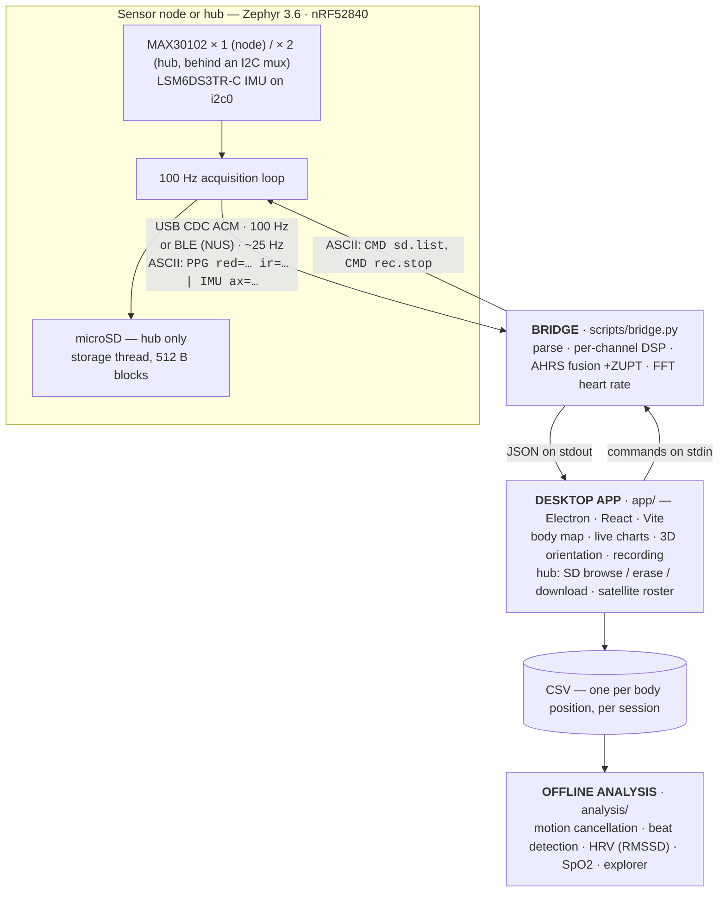
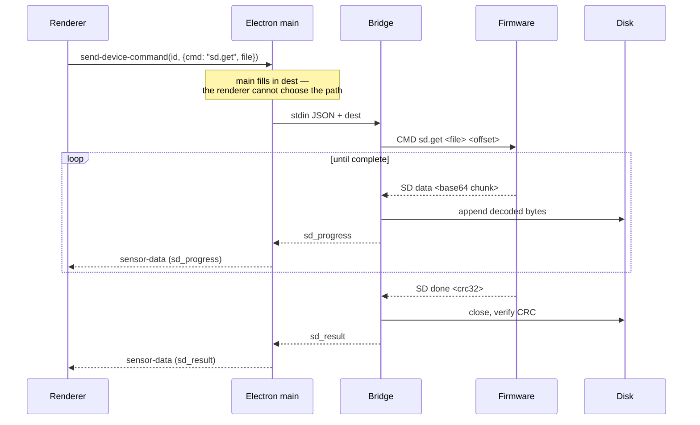

# Data Contracts

Three formats hold this system together. They are the real interfaces between
firmware, bridge, desktop app and analysis code — change one and something
downstream breaks, so they are documented here in one place.

1. [Device → host: the ASCII line protocol](#1-device--host-ascii-line-protocol)
2. [Host → device: the command channel](#1b-host--device-the-command-channel)
3. [Bridge → app: JSON on stdout](#2-bridge--app-json-lines)
4. [App → disk: the session CSV](#3-app--disk-session-csv)

Plus [the logger CSV](#4-logger-csv-analysis-input), which is a fourth, older
format the offline pipeline consumes.

---

## The chain



> **No mesh.** Nodes do not talk to each other, and neither does the hub — it
> carries two of its own sensors, not other people's. Each device is an
> independent BLE peripheral / USB CDC device; multi-node aggregation happens
> entirely on the host, one bridge process per device. A hub's satellite roster
> is configuration the hub remembers, not a link it uses.

The bridge is shipped two ways: run straight from source during development, and
frozen with PyInstaller into a standalone binary for installed copies of the app,
so end users never install Python.

---

## 1. Device → host: ASCII line protocol

Both transports carry **exactly the same** newline-delimited ASCII. The BLE path
is not a separate binary protocol — `firmware/src/main.c` formats each line once
and hands the same buffer to `printk()` and `ble_send()`.

| | USB | BLE |
|---|---|---|
| Carrier | USB CDC ACM virtual COM port, 115200 8N1 (nominal) | Nordic UART Service notifications |
| Rate | 100 Hz (every sample) | ~25 Hz (one line per 40 ms) |

The BLE path is rate-limited on purpose: a BLE link at default Windows connection
parameters carries roughly 4 kB/s, while 100 Hz × ~120 B would be 12 kB/s and
overflows the TX queue immediately. USB gets every sample; BLE gets a display-rate
subset.

### Sample line

A single-PPG node:

```
PPG red=<uint> ir=<uint> | IMU ax=±D.DDD ay=±D.DDD az=±D.DDD gx=±D.DDD gy=±D.DDD gz=±D.DDD
```

A dual-PPG hub, which inserts one extra section and is otherwise identical:

```
PPG red=<uint> ir=<uint> | PPG1 red=<uint> ir=<uint> | IMU ax=±D.DDD …
```

| Field | Range / unit |
|---|---|
| `red`, `ir` | 0 … 262143 (18-bit ADC counts) |
| `ax` `ay` `az` | m/s² |
| `gx` `gy` `gz` | **rad/s** (Zephyr sensor API — not deg/s) |

Numbers are formatted as fixed 3-decimal "integer.milli" from
`sensor_value.val1`/`val2`. A node's line is about 120 bytes and a hub's about
144; the node's firmware buffer is 160, the hub's 192.

> **The `PPG red=` prefix is load-bearing, and one line is not two.** The bridge
> matches with `re.search`, so a hub's line still yields sensor 0 to a bridge
> that knows nothing about `PPG1` — old host, new firmware, still works. The
> reverse trick does not: the parser **silently discards** any unmatched line
> beginning with `PPG`, so a separate `PPG1 …` line would vanish without trace.
> Keeping both sensors in one message also gives the pair one arrival timestamp,
> which is the only thing tying the two channels together in time on the host.
>
> Nothing else on either stream may start with `PPG` — not the `Hub:` status
> line, not any command reply. That is why they are prefixed the way they are.

### Identity line

Emitted at boot and again on every new BLE connection, on both transports:

```
ID model=hub proto=2 fw=1.2.0 ppg=2 sd=1 name=PhysDAQ-Hub-FDF9
```

| Field | Meaning |
|---|---|
| `model` | `node` or `hub` |
| `proto` | identification protocol version (this is 2) |
| `fw` | firmware version, from `src/version.h` |
| `ppg` | PPG channel count — how many the sample line will carry |
| `sd` | `1` when a card is mounted and usable, `0` otherwise |
| `name` | the advertised name, so USB and BLE views agree |

**This is the authority on what a device is.** The advertisement carries the
same device class (see *BLE identifiers* below), but USB has no advertising at
all, so a cabled device is unidentifiable without this line. It is re-sent on
every connection because a central that connects late missed the boot copy —
and on USB, where the CDC ACM port does not exist yet while the board boots, the
boot copy is routinely lost too. `CMD id` asks for it on demand.

### Auxiliary lines on the same stream

Everything below shares the stream with sample lines. The bridge matches sample
and battery lines with regexes and forwards **all other lines to stderr**, which
the desktop app surfaces in its System Logs pane.

> **USB vs BLE:** `printk()` only reaches the USB console. The battery line, the
> periodic `Power:` status, the MAX30102 reinit message and the two BLE link
> diagnostics (`previous link ended`, `conn params`) are explicitly dual-sent
> over BLE so a wireless node still streams diagnostics to the app; every other
> line (boot banner, BLE events, watchdog) is USB-only.

```
Battery: 71% (3940 mV)
Power: idle 4s/10s | skin: yes (dc=29050) | ble: yes (dropped 12) | usb: no | peak ~12mrad/s (thresh 100mrad/s)
Power: 10 s idle — entering deep sleep (wake on motion)
MAX30102: ready (SpO2, 100 Hz, 18-bit ADC)
MAX30102: no data for >1s — reinitialising sensor
BLE: connected
BLE: MTU 247 bytes (244 payload)
BLE: conn params: interval 30 ms, latency 0, timeout 5000 ms
BLE: previous link ended reason=0x08 (supervision timeout (radio fade))
Boot: cause=0x4 (software (fatal error or reboot)), up 0 s
Crash: stack overflow (reason 2) in ble_tx pc=0x0002a1c4 lr=0x0002a0f1
Hang: main starved 3012 ms at stage "printk" (main pending); CPU held by "BT RX" prio -8 pc=0x00031b20
BLE: disconnected (reason 0x13 closed by host) — advertising
Watchdog: armed (8000 ms, reset-on-hang)
```

The **boot report** — `Boot:` always, `Crash:` and/or `Hang:` only when the
previous boot ended that way — follows the `ID` line on every new host link
(BLE subscription or USB port opened). `Boot: cause=` is the nRF reset reason:
`watchdog`, `software` (a fatal error that `crashlog.c` turned into a reboot),
`wake from deep sleep`, `reset pin`, `power-on`. `Crash:` names the fault and the
thread with PC/LR; `Hang:` says where `main()` was stuck and which thread held
the CPU when the starvation monitor fired 3 s before the watchdog reset. A node
that "keeps disconnecting" and shows any of these is rebooting, not losing the
radio — read them before touching the link parameters. `dropped N` in the
`Power:` line counts BLE lines the node sacrificed because its TX queue was
full; a steady number is normal, a jump of hundreds is a stall.

`BLE: previous link ended` is sent once, on the first connection after a link
was lost, and is the only place the *cause* of a drop is visible from the app —
the OS side (bleak) never reports one. The codes are HCI reasons: `0x08`
supervision timeout (the radio faded or the node reset), `0x13` the host closed
it, `0x16` the node closed it, `0x3e` connection failed to establish. The bridge
logs its own side (`BLE: link to … dropped (reported by the OS N s after the
last notification)`) so the two can be lined up, and drops a link itself after
8 s without a notification (`BLE: no data for 8 s — dropping the link to
reconnect`) rather than sitting on a connection the OS has not noticed is dead.

Plus the boot banner:

```
=== PhysDAQ: PPG + IMU acquisition ===
PPG: SpO2 mode, 100 Hz, 18-bit ADC
IMU: accel [m/s^2], gyro [rad/s]
BLE: NUS advertising as PhysDAQ
Battery: VBAT via P0.31/AIN7, sampled every 5 s
Power: sleep after 10 s idle
```

### BLE identifiers

Stock Nordic UART Service UUIDs — the device does not define custom ones:

| Role | UUID |
|---|---|
| Service | `6e400001-b5a3-f393-e0a9-e50e24dcca9e` |
| TX (device → host, notify) | `6e400003-b5a3-f393-e0a9-e50e24dcca9e` |
| RX (host → device, write w/o response) | `6e400002-b5a3-f393-e0a9-e50e24dcca9e` |

The advertised name is `PhysDAQ-XXXX`, where the suffix is the last two bytes of
the SoC's factory device ID (`hwinfo_get_device_id()`), so two nodes are
distinguishable in a scan. It is derived at boot rather than stored — this board
has no NVS configured — and is stable across reboots and reflashes because the
ID is burned into FICR.

**No host code matches on the name.** Every Python client discovers by service
UUID, which is advertised in the AD payload precisely so scanners can filter on
it; `bridge.py --scan` does exactly that. Renaming the device does not break
discovery. The desktop app can additionally attach a user-chosen alias to an
address, but that lives host-side in `nodes.json`, not on the node.

### Device class in the advertisement

Alongside the service UUID, the AD carries a manufacturer-specific field under
company ID `0xFFFF` — the Bluetooth SIG's reserved "local use" value, which is
what this is: a private hint, not an assigned identifier. bleak strips the
company ID and hands the host the rest:

| Byte | Meaning |
|---|---|
| 0 | AD protocol version (2) |
| 1 | device type — `0x01` node, `0x02` hub |
| 2 | PPG channel count |
| 3 | flags — bit 0: has removable storage |

This exists so the scan list can label an entry **before** connecting. It does
not change how discovery works: the filter is still the service UUID, never this
field and never the name. Once connected, the ID line is what decides.

Firmware older than protocol 2 omits the field; a host that finds it missing or
unreadable reports a single-PPG node. That fallback direction is deliberate —
under-reporting a hub is corrected by the ID line seconds later, whereas guessing
"hub" would have the app wait for a second channel that never arrives.

Payload budget: 3 (flags) + 18 (128-bit UUID) + 8 (manufacturer data) = 29 of the
31 bytes allowed. The name goes in the scan response, not here.

---

## 1b. Host → device: the command channel

The RX characteristic `6e400002-…` used to be a no-op. It now carries
newline-terminated ASCII commands, as does the USB console (which needed an
input path added: `CONFIG_CONSOLE_GETCHAR`). Replies come back on the normal
output stream, interleaved with samples.

Implemented on the **hub only** — `firmware-hub/src/command.c`. The single-PPG
node still has a no-op handler.

### Requests

```
CMD id                      re-send the identity line
CMD sd.stat                 card usage and session state
CMD sd.list                 enumerate session files
CMD sd.del <name>           delete one session file
CMD sd.format               delete every session file
CMD rec.start               open the next session file
CMD rec.stop                close the current session file
CMD sd.get <name> [offset]  stream a session file back, base64
CMD sd.abort                stop an in-flight sd.get
CMD sat.list                list configured satellites
CMD sat.add <addr> [label]  remember a satellite
CMD sat.del <addr>          forget one
CMD sat.clear               forget all
```

`sd.abort` is recognised during line assembly rather than by the dispatcher.
It has to be: a download runs inside the command thread, so a request routed the
normal way could only be read once there was nothing left to abort.

### Replies

```
SD stat mounted=1 used=12345678 total=31914983424 sess=4 open=1 w=2400 drop=0 err=0
SD stat mounted=0 err=<errno>
SD file SESS0001.BIN 5242880
SD list end n=3
SD ok <verb> [<detail>]
SD err <verb> <errno>
SD data <name> <offset> <len> <base64>
SD data end <name> <total> crc=<crc32>
SD data abort <name> <offset>
REC state=on sess=5
REC state=off
SAT n=2 max=8
SAT entry 0 addr=E1:23:45:67:89:AB src=0x10 label=wrist_L
SAT list end
SAT ok <verb> [<detail>]
SAT err <verb> <errno>
```

Errno values are numbers, not strings, so the host can branch on them. The ones
that carry meaning: `ENODEV` (19) no card, `EBUSY` (16) a session is open,
`EINVAL` (22) bad filename or address, `ENOSPC` (28) roster full.

### Download

`sd.get` streams the file as base64 over the same ASCII lines as everything
else. That costs 33 % in size, and the transfer shares the link with the live
sample stream: **a one-hour session is roughly 11 MB, so about 50 minutes over
BLE and 20 over USB CDC.** Prefer USB, and show the estimate before starting.

The firmware yields between chunks so the sample stream keeps flowing — without
that the live view would go dead for the whole transfer, which looks exactly
like a crash. The trailing CRC32 is what distinguishes a complete file from one
missing a dropped chunk; `sd.get` takes an offset so an interrupted transfer can
resume rather than restart.

The bridge writes the file itself and never forwards the bytes to the app: a
one-hour session through Electron IPC and into React state would cost far more
than the transfer. Only progress is reported.

That inversion is the thing to keep in mind — the request crosses every layer,
but the payload leaves the chain at the bridge:



Files land in `Documents/PhysDAQ_Sessions/hub_downloads/`. Nothing in this
repository parses them yet — see [roadmap.md](roadmap.md).

### Satellites

`sat.*` is **configuration only**. The hub stores the roster in NVS and reports
it; it does not scan for these nodes, connect to them, or record anything from
them. `prj.conf` enables `BT_PERIPHERAL` alone with `BT_MAX_CONN=1`, and the hub
never takes the central role. See [firmware-hub.md](firmware-hub.md) for why
ingestion is not implemented.

---

## 2. Bridge → app: JSON lines

`scripts/bridge.py` writes one JSON object per line to stdout, flushed
immediately.

### `sample`

```json
{
  "type": "sample",
  "red": 28451, "ir": 29033,
  "ppg_filt": -12.47,
  "ax": 0.213, "ay": -9.706, "az": 0.884,
  "gx": 0.001, "gy": -0.004, "gz": 0.002,
  "quat": [0.9993, 0.0121, -0.0344, 0.0058],
  "bpm": 72.4,
  "contact": true,
  "ch": [
    {"i": 0, "red": 28451, "ir": 29033, "ppg_filt": -12.47, "bpm": 72.4, "contact": true},
    {"i": 1, "red": 11072, "ir": 11840, "ppg_filt":   3.02, "bpm": 71.8, "contact": true}
  ]
}
```

- `quat` is `[w, x, y, z]` in the **NWU** convention (North-West-Up, Z up).
- `bpm` is `null` when there is no contact or no confident spectral peak.
- `ppg_filt` is the AC component of the IR channel after a single-sample EMA
  band-pass; it is what the app's main waveform chart displays.
- **`ch` is additive, and the top level is channel 0.** A node emits one entry,
  a hub two. Keeping channel 0 duplicated at the top level is what lets the CSV
  writer, the charts and the recording schema stay exactly as they were.
- Each channel carries its **own** BPM, contact state and filter baseline. A
  hub's two sensors sit at different body sites; sharing any of that between
  them would blend two unrelated pulses into one meaningless number. The
  quaternion and IMU stay shared — there is one IMU per board.

### `identity`

```json
{"type": "identity", "model": "hub", "proto": 2, "fw": "1.2.0",
 "ppg_count": 2, "has_sd": true, "name": "PhysDAQ-Hub-FDF9", "source": "device"}
```

`source` is `device` when parsed from the ID line and `cli` when it came from
`--device-type=`, which the app passes so the UI can lay out two channels
before the first sample arrives. The device's own line supersedes it.

### `hub_status`

The hub's 5-second health line, parsed rather than dumped to stderr:

```json
{"type": "hub_status", "uptime_s": 3600,
 "sensors": [{"i": 0, "alive": true, "samples": 360000, "rate_hz": 100.0,
              "overflows": 0, "reinits": 0, "ir": 29033}],
 "sd": {"sess": 4, "open": 1, "w": 719000, "drop": 0, "sync": 3600, "err": 0, "qmax": 64},
 "satellites": {"n": 2, "max": 8}}
```

`drop` and `err` are the numbers to watch on an endurance run; both should stay
at zero.

### Command replies

One shape per reply family, all mirroring section 1b:

```json
{"type": "sd_stat", "mounted": true, "used": 12345678, "total": 31914983424, "sess": 4, "open": 1}
{"type": "sd_file", "name": "SESS0001.BIN", "size": 5242880}
{"type": "sd_list_end", "n": 3}
{"type": "sd_result", "verb": "sd.del", "ok": true, "detail": "SESS0002.BIN"}
{"type": "sd_result", "verb": "sd.format", "ok": false, "errno": 16}
{"type": "sd_progress", "file": "SESS0001.BIN", "bytes": 1048576}
{"type": "rec_state", "recording": true, "session": 5}
{"type": "sat_begin", "n": 2, "max": 8}
{"type": "sat_entry", "slot": 0, "addr": "E1:23:45:67:89:AB", "source_id": 16, "label": "wrist_L"}
{"type": "sat_end"}
{"type": "sat_result", "verb": "sat.add", "ok": true}
```

Listings stream entry by entry and are terminated by `sd_list_end` / `sat_end`.
The app accumulates into a pending list and swaps it in only on that terminator,
so a listing cut short by a disconnect cannot be mistaken for an empty card.

`sd_result` carries a device-reported failure in `errno` (a number, as in
section 1b). Failures that happen **host-side** — before the device ever answers,
or because the transfer was cancelled — use a string `error` instead, and the
successful case sets `"error": null`:

```json
{"type": "sd_result", "verb": "sd.get",  "ok": false, "file": "SESS0001.BIN", "error": "aborted"}
{"type": "sd_result", "verb": "sd.list", "ok": false, "error": "not connected"}
{"type": "sd_result", "verb": null,      "ok": false, "error": "<write failure>"}
```

The third form — `verb: null` — is a BLE write that threw before the verb could
be attributed. A host matching on `verb` will not see it, so branch on `ok`
first.

A finished download reports both checksums so a mismatch is visible rather than
inferred:

```json
{"type": "sd_result", "verb": "sd.get", "ok": true, "file": "SESS0001.BIN",
 "path": "C:\Users\...\PhysDAQ_Sessions\hub_downloads\SESS0001.BIN",
 "bytes": 5242880, "expected": 5242880, "crc": "97d0ab42", "device_crc": "97d0ab42"}
```

### `battery`

```json
{"type": "battery", "pct": 71, "mv": 3940}
```

### `status`

```json
{"status": "connecting"}
{"status": "connected",   "port": "COM7"}
{"status": "connected",   "ble_addr": "E1:23:45:67:89:AB"}
{"status": "disconnected"}
```

`connecting` never carries a target — the bridge emits it before it knows which
port or address it will end up on. `port` appears on a serial `connected`,
`ble_addr` on a wireless one.

The bridge retries on its own after a `disconnected`, so a dropped link produces
`disconnected` → `connecting` → `connected` without the app doing anything. The
process itself lives until its stdin closes, at which point it exits
immediately — that is what guarantees no orphaned serial port when the app
quits.

### `error`

```json
{"error": "bleak not installed"}
```

Anything the bridge cannot parse from the device goes to **stderr**, prefixed
`FW: `, and is displayed in the app rather than being silently dropped. The one
exception is the `PPG`-prefixed discard rule above: an unmatched line starting
with `PPG` is dropped without a trace.

The bridge also writes its own diagnostics to the same stream, unprefixed — the
periodic `Link rate: N samples/s`, and `Serial:` / `BLE:` / `Bridge:` / `AHRS:`
notices. They share the app's System Logs pane with the firmware's own output.

### Bridge invocation

| Argument | Behaviour |
|---|---|
| *(none)* | Serial, port auto-detected by USB descriptor |
| `<PORT>` | Serial on an explicit port |
| `--ble` | BLE, first device advertising the NUS UUID |
| `--ble-addr=<addr>` | BLE, specific address |
| `--device-type=hub` | Expect two PPG channels without waiting for the ID line |
| `--list-ports` | Print `[{port, desc, hwid}]` and exit |
| `--scan` | Print `[{address, name, rssi, device_type, ppg_count, has_sd}]` and exit |
| `--scan-all` | Same, without the service-UUID filter |

### stdin: the command channel

The app writes one JSON command per line to the bridge's stdin; the bridge
translates it into the firmware's `CMD …` grammar and writes it to the RX
characteristic or the serial port.

```json
{"cmd": "sd.list"}
{"cmd": "sd.del", "file": "SESS0002.BIN"}
{"cmd": "sd.get", "file": "SESS0001.BIN", "dest": "C:\...\SESS0001.BIN", "offset": 0}
{"cmd": "sat.add", "addr": "E1:23:45:67:89:AB", "label": "wrist_L"}
```

`dest` is host-side only — the firmware never sees it. The main process fills
it in, so the renderer cannot choose where a file lands.

The bridge still exits on stdin **EOF**, which is how the desktop app guarantees
no orphaned processes keep a serial port or BLE link open. Reading line by line
did not change that.

---

## 3. App → disk: session CSV

Written by `app/src/main/sidecar.ts` while recording.

**Location:** `Documents/PhysDAQ_Sessions/session_<ISO-date>_<name>/<position>.csv`

- The ISO timestamp has `:` and `.` replaced by `-` to be filesystem-safe.
- `<name>` is the user's session name with everything outside `[A-Za-z0-9_-]`
  replaced by `_`.
- `<position>` is the body slot: `head`, `chest`, `wrist_left`, `wrist_right`,
  `finger_left`, `finger_right`, `ankle_left`, `ankle_right`. **One file per
  body-position slot**, all sharing a common session start time.

> **A hub writes two files, not one.** Its two PPG sensors are worn at two
> different sites, so it claims two slots and each gets its own CSV in the
> unchanged 17-column schema — indistinguishable from a node's. What differs is
> that the two files share an IMU: their `ax…gz` and quaternion columns are
> identical, and only the `ppg_*`, `bpm` and `contact` columns differ. The
> recording map is keyed on the slot rather than on the device precisely so this
> falls out without a schema change.

**Header (17 columns):**

```
timestamp,elapsed_s,ax,ay,az,gx,gy,gz,qw,qx,qy,qz,ppg_red,ppg_ir,ppg_filt,bpm,contact
```

| Column | Notes |
|---|---|
| `timestamp` | ISO-8601 **string** — host arrival time, written by the app. The device sends no clock of its own, so this is the only time base in the file, and it carries the link's latency. |
| `elapsed_s` | seconds since session start, float |
| `ax…gz` | as on the wire (m/s², rad/s) |
| `qw qx qy qz` | orientation quaternion, NWU |
| `ppg_red`, `ppg_ir` | raw 18-bit counts |
| `ppg_filt` | band-passed IR AC component |
| `bpm` | **blank** when unavailable |
| `contact` | `0` or `1` |

> Sessions recorded before the project was renamed live in
> `Documents/MAID_Sessions`. The app still lists them read-only; it only ever
> writes to `PhysDAQ_Sessions`.

Files pulled off a hub's card land in
`Documents/PhysDAQ_Sessions/hub_downloads/` — a sibling of the session folders,
not one of them. They are raw `.BIN` in the format
[firmware-hub.md](firmware-hub.md) documents, and nothing in this repo reads
them yet.

---

## 4. Logger CSV (analysis input)

`analysis/logger.py` writes a **different, older and simpler** format to
`logs/YYYY-MM-DD_HH-MM-SS.csv`:

```
timestamp,red,ir,ax,ay,az,gx,gy,gz
```

Here `timestamp` is a **float** (seconds), and the PPG columns are `red`/`ir`,
not `ppg_red`/`ppg_ir`.

> ⚠️ **These two CSV formats are not interchangeable.** `analysis/pipeline.py`
> does `pd.read_csv(path).astype(float)` and expects the logger schema — it will
> raise on an app-recorded session's ISO timestamp, and the `red`/`ir` columns it
> wants do not exist there. There is currently no converter in the repo. See
> [roadmap.md](roadmap.md).
