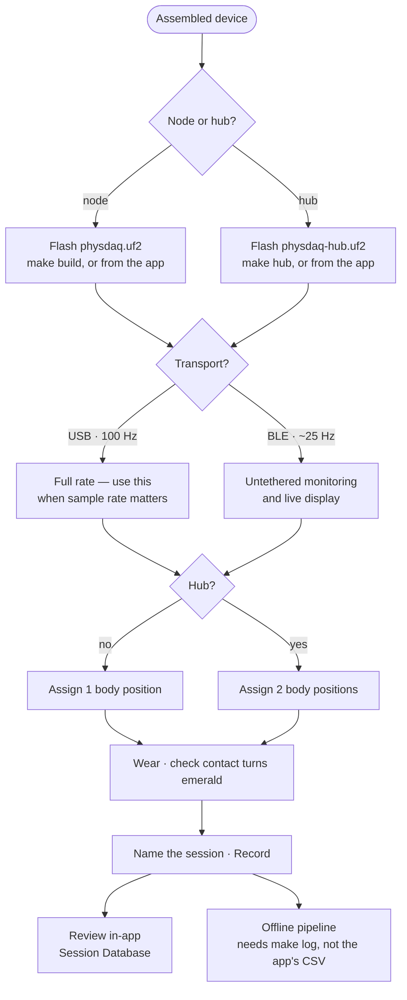

# User Guide

How to prepare a PhysDAQ node, connect it to the desktop app, record a session,
and review the data afterwards.

This guide assumes the hardware is already assembled. For wiring, see
[hardware.md](hardware.md); for building from source, see
[development.md](development.md).

There are two kinds of device. A **node** carries one PPG sensor and occupies one
body position. A **hub** carries two PPG sensors, occupies two body positions from
a single connection, and records to its own microSD card as well as streaming.
Everything below applies to both unless it says otherwise.



---

## Installing the app

Download the file for your machine from the
[Releases page](https://github.com/haksolot/PhysDAQ/releases):

| Your machine | Download |
|---|---|
| Windows | `physdaq-<version>-setup.exe` |
| Mac (Apple Silicon) | `physdaq-<version>-arm64.dmg` |
| Linux | `physdaq-<version>-x86_64.AppImage`, or the `.deb` |

> The Windows build has been run and verified. The Mac and Linux builds package
> cleanly but have not yet been launched on real hardware — if something is
> wrong there, please open an issue.

The downloads are **not code-signed** — PhysDAQ is a lab instrument, not a
commercial product, and a signing certificate costs money the project does not
have. Your system will warn you the first time. This is expected:

- **Windows** — SmartScreen shows "Windows protected your PC". Click
  **More info** → **Run anyway**.
- **macOS** — the app is blocked on a double-click. **Right-click the app →
  Open**, then confirm. You only need to do this once.
- **Linux** — make the AppImage executable first: `chmod +x physdaq-*.AppImage`.
  To read a node over USB you also need to be in the `dialout` group
  (`sudo usermod -aG dialout $USER`, then log out and back in).

---

## 1. Prepare a node

### Flash the firmware

1. Connect the node over USB-C.
2. **Double-tap the RST button.** A mass-storage drive named `XIAO-SENSE`
   appears.
3. Copy the firmware onto it:

```bash
make flash
```

The board reboots by itself as soon as the copy finishes. If the drive is not
found, `make flash` prints the absolute path of the `.uf2` so you can drag it
across manually.

### Flashing from the desktop app

The installed app carries a firmware image, so you do not need a build toolchain
to set up a node:

1. Connect the device over USB.
2. Open a sensor slot's **Link** dialog, set **Device Type**, and press
   **Flash node firmware** or **Flash hub firmware**.
3. **Double-tap the RST button** when prompted. The app waits up to a minute for
   the `XIAO-SENSE` drive to appear, copies the image, and confirms.

The device reboots by itself. If it is already connected in the app, the flash
step disconnects it first — a serial port cannot be held open while the device
behind it is being flashed.

> **The Device Type selector decides which image is written**, and nothing checks
> it against the board. Both images run on the same hardware, so flashing node
> firmware onto a hub succeeds and silently gives you one sensor and no card.
> Confirm the selector before flashing.

If you built the app from source, it flashes whatever you last compiled —
`make build` for a node, `make hub` for a hub — and the button is disabled until
the matching image exists.

### Check that it works

```bash
make term
```

You should see the boot banner followed by a stream of sample lines:

```
ID model=node proto=2 fw=1.2.0 ppg=1 sd=0 name=PhysDAQ-FDF9
=== PhysDAQ: PPG + IMU acquisition ===
PPG: SpO2 mode, 100 Hz, 18-bit ADC
IMU: accel [m/s^2], gyro [rad/s]
BLE: NUS advertising as PhysDAQ
Battery: VBAT via P0.31/AIN7, sampled every 5 s
Power: sleep after 10 s idle
...
PPG red=28451 ir=29033 | IMU ax=0.213 ay=-9.706 az=0.884 gx=0.001 gy=-0.004 gz=0.002
Battery: 71% (3940 mV)
```

The first line is the device identifying itself — `model=node` or `model=hub`,
and `ppg=` how many sensors it carries. It is the quickest way to confirm you
flashed the image you meant to.

With nothing touching the sensor, `ir` reads a few hundred. Place a fingertip on
the PPG window and it jumps to ~29 000 — that is the contact threshold the whole
system uses.

Press `Ctrl+]` then `q` to quit the terminal.

---

## 2. Wearing and placement

- The PPG window must sit **flat against skin** with light, steady pressure. Too
  loose and the signal drops out; too tight and you restrict perfusion and lose
  the pulse.
- Fingertip, wrist (over the radial artery) and earlobe give the strongest
  signals. Torso and ankle placements are usable but noisier.
- Keep the node **still** during a measurement window. Motion is the dominant
  artefact source; the offline pipeline can regress much of it out, but clean
  data is always better.
- Give it 10–20 s to settle after placement before starting a recording.

---

## 3. Connect nodes in the app

Launch PhysDAQ (installed build, or `npm run dev` from `app/`).

On the **Body Network** page, click any of the eight body positions — head,
chest, wrist ×2, finger ×2, ankle ×2 — to open the *Configure Sensor Node*
dialog.

1. Choose the transport: **USB Serial** or **BLE NUS**. The dialog scans
   automatically on open and whenever you switch transport. Positions default to
   BLE, except *chest*, which defaults to USB.
2. Pick the discovered port or device from the list, or leave it on
   *auto-detect*. A manual override field is there if a device does not appear,
   and **Show all BLE devices** drops the PhysDAQ filter if a node advertises
   without its service UUID. Hubs are badged **HUB** in the list.
3. Set **Device Type** — `Node · 1 PPG` or `Hub · 2 PPG + SD`. A hub advertises
   its type, so this is usually pre-selected; set it by hand for a device
   connected over USB or running older firmware. It also decides which firmware
   image the Flash button writes.
4. For a hub, pick a **Second PPG Position**. The hub then occupies two body
   positions from one connection and writes two CSVs. Leaving it unset is
   allowed — the second sensor is still acquired and still logged to the hub's
   card, but it is not charted and not written to a session CSV.
5. Optionally give the device a **Node Name**; it is remembered across sessions.
6. Confirm. The marker turns amber (connected, not worn) and then emerald once
   skin contact is detected.

Repeat for each device. There are eight body positions in total, and a hub
consumes two of them — so four hubs fill the map. Each connection is an
independent process.

A hub's two positions are badged **HUB·S0** and **HUB·S1** in the inventory.
They share one battery, one radio link and one IMU, so orientation, battery and
link status are identical on both; only the PPG differs.

**Marker colours**

| Colour | Meaning |
|---|---|
| Emerald | Connected and worn |
| Amber | Connected, no skin contact |
| Primary (purple) | Connecting |
| Muted (grey) | Disconnected |

> Over BLE the app receives ~25 Hz rather than the full 100 Hz — a deliberate
> rate limit, since a BLE link cannot sustain the full stream. **Use USB for
> anything where sample rate matters.** BLE is for untethered monitoring and
> live display.

---

## 4. Live monitoring

Click a connected node's **Detail** button for:

- **PPG Filtered** — the pulse waveform. This is what you look at to judge signal
  quality; a clean trace shows a clear repeating pulse with a visible dicrotic
  notch.
- **PPG Raw** — red and IR channels at 18-bit. Useful for checking contact and
  saturation.
- **IMU gyro** — angular rate on all three axes.
- **3D board orientation** — live attitude from the fusion filter.
- Cards for heart rate, wear status, battery, and raw telemetry.
- **System Logs** — everything the device printed that wasn't a data sample,
  including battery, power state and any sensor re-initialisation.

Heart rate needs about 8 s of contact before the first value appears — it comes
from a sliding spectral window, not from single beats. It shows `--` when there
is no contact or no confident estimate.

---

## 5. Record a session

1. On the **Body Network** page, enter a session name.
2. Press **Record**. A `mm:ss` timer starts.
3. Press **Stop** when finished.

All currently connected devices are recorded, sharing a common session start
time. There is one CSV **per body position**, not per device — so a hub occupying
two positions writes two files, one per sensor.

**Where files go:**

```
Documents/PhysDAQ_Sessions/session_<date>_<name>/
    chest.csv
    wrist_left.csv
    ...
```

Only devices connected **at the moment you press Record** are included —
connecting another one mid-session does not add it. Stop and restart if you need
to change the set.

This is the app's own recording, on the host. A hub can *also* record to its own
card at the same time, started separately from the Hub Storage panel; the two are
independent.

Columns are documented in [protocol.md](protocol.md#3-app--disk-session-csv).

---

## 6. Review recordings

The **Session Database** page lists every saved session with its date, duration
and node count.

> A `hub_downloads` folder sits alongside the sessions — it holds raw `.BIN`
> files pulled off a hub's card, and is skipped by this list.

Select a session, then a node's CSV, to load it into the timeline scrubber:

- Drag or click the viewport box on the sparkline to pan.
- **Zoom In / Zoom Out**, **Scroll Left / Right**, **Reset View**.
- Type exact start/end percentages for a precise window.

The selected range is rendered in the same three charts used for live view. Time
labels along the scrubber are wall-clock times from the recording.

The trash icon on a session row deletes the whole folder from disk — this is
immediate and not undoable.

> Sessions recorded before the project was renamed from MAID still appear here.
> They are read from `Documents/MAID_Sessions` and remain fully usable; new
> recordings always go to `PhysDAQ_Sessions`.

---

## Working with a hub

A hub's Node Detail page carries two extra panels. Both are reachable from either
of its two body positions — they act on the device, not the slot.

### Hub Storage

Shows the card's used and total space, whether a session is currently open, and
the running counters for records written, dropped and errored. `dropped` should
be zero; anything else means the card could not keep up.

- **New session** starts a recording on the card, **Stop session** ends it. This
  is the hub's own recording and is independent of the app's Record button — you
  can run either, both, or neither.
- Each file on the card can be **downloaded** or deleted. Downloads land in
  `Documents/PhysDAQ_Sessions/hub_downloads/`.
- **Erase card** removes every session file. It requires typing `ERASE` to
  confirm, and it deliberately does *not* reformat — anything the firmware did
  not write is left untouched.

> **Downloads share the radio link with the live stream.** A one-hour session is
> roughly 11 MB, which is about 50 minutes over BLE and 20 over USB. The panel
> shows an estimate before you start. Prefer USB, and expect the live view to
> slow down during a transfer.

> **Nothing in this project reads a downloaded `.BIN` yet.** The files are a raw
> deliverable for now — the offline pipeline cannot open them. See
> [roadmap.md](roadmap.md).

### Satellites

A hub remembers a roster of up to eight other nodes, each with an address and a
short label.

> **This is configuration only.** The hub does not scan for these nodes, connect
> to them, or record anything from them — the roster is remembered for a future
> capability that is **not implemented**. Adding an entry changes nothing about
> what gets captured today. The panel says so permanently, and it is worth
> repeating: if you want a second node's data, connect it to the app as its own
> device.

### Sleep

A hub does **not** deep-sleep — the feature is compiled out. The idle timeout and
wake-on-motion behaviour described under *Battery and sleep* below applies to
single-PPG nodes only. A hub stays awake until it loses power.

---

## 7. Offline analysis

The app is for acquisition and quick review. For beat detection, HRV, SpO2 and
motion cancellation, use the Python pipeline:

```bash
make log                              # record via the standalone logger
make process FILE=logs/<file>.csv     # → *_enriched.csv, *_beats.csv
make explore FILE=logs/<file>.csv     # interactive viewer
```

> ⚠️ The offline pipeline currently reads the **logger's** CSV format, not the
> app's. Use `make log` for recordings you intend to process offline. Details and
> workaround status in [analysis.md](analysis.md).

---

## Battery and sleep

> This section describes the **single-PPG node**. A hub has deep sleep disabled
> and never enters it.

A node reports its charge every 5 s; the app shows it on the node's detail page.

After `CONFIG_PHYSDAQ_IDLE_TIMEOUT_SEC` seconds (default 10) with **no motion and
no skin contact**, the node enters deep sleep at ~0.4 µA. Wearing it while sitting
perfectly still does *not* put it to sleep — only setting it down does.

**Waking it:** pick it up or move it. The node performs a full reset, so:

- its USB serial port disappears and comes back as a new one;
- the app shows the node as disconnected and you must reconnect it.

To change the timeout, edit `firmware/prj.conf` and reflash:

```
CONFIG_PHYSDAQ_IDLE_TIMEOUT_SEC=30    # range 5–300
```

```bash
make rebuild && make flash
```

---

## Troubleshooting

| Symptom | Likely cause | Fix |
|---|---|---|
| No devices in the BLE scan | Node asleep, or already connected elsewhere | Move the node to wake it; a node accepts one connection at a time |
| Node connects then drops immediately | Another process holds the serial port | Close `make term` / the live plotter first |
| Flat or noisy PPG trace | Poor skin contact | Reseat the sensor; steady, light pressure |
| BPM stays `--` | No contact, or too much motion | Check wear status shows WORN; hold still 10 s |
| Wear status says worn with nothing on it | A reflective surface at the right distance reads like skin | Known limitation of DC-only contact detection |
| Orientation drifts in yaw | No magnetometer on this board | Expected; roll and pitch stay accurate |
| Serial port vanished mid-session | Node went to sleep | Wake it and reconnect |
| App says "Python sidecar not found" | Development build without the frozen bridge | See [development.md](development.md#packaging-the-desktop-app) |
