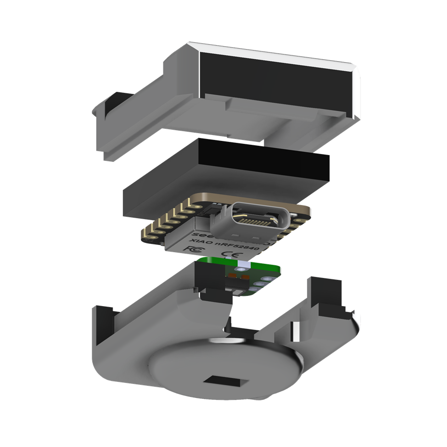

# PhysDAQ Enclosure

3D-printable case for a PhysDAQ sensor node.

<p align="center">
  
</p>

> **Status: a first design is filed, in STEP only.** The case and lid are
> modelled — [`models/physdaq-case-v1.step`](models/physdaq-case-v1.step) and
> [`models/physdaq-lid-v1.step`](models/physdaq-lid-v1.step) — but neither has
> an editable source (`.f3d`) or a printable mesh (`.stl`) committed alongside
> it, so the convention below is only half satisfied. Slice the STEP directly,
> or import it to reproduce a source.
>
> The constraints in this document remain the specification any design has to
> satisfy. See [roadmap.md](../../docs/roadmap.md).

This document covers the **single-PPG node**. The hub is a larger board build
with a different pin map and a microSD card, and has no enclosure design.

---

## What has to fit inside

| Component | Approximate footprint | Constraints |
|---|---|---|
| XIAO nRF52840 Sense | 21 × 17.5 × 3.5 mm | USB-C port and RST button must remain accessible |
| MAXREFDES117# | ~19 mm circular module | Optical window must reach the skin |
| LiPo cell | designer's choice | Soldered to the XIAO's BAT pads on the underside |
| Wiring | 5 conductors | 3V3, GND, SDA (D4), SCL (D5), INT (D1) |

Pin assignments and electrical details: [../../docs/hardware.md](../../docs/hardware.md).

---

## Design requirements

**Hard requirements** — the device does not work without these:

1. **Optical window flush with the skin.** The MAX30102's LEDs and photodiode
   must contact the skin directly, with no air gap and no material in the optical
   path. Either leave an open aperture or use an optically clear window; opaque
   or diffusing plastic over the sensor kills the signal.
2. **Optical isolation.** Light from the LEDs must not reach the photodiode
   except through tissue. A raised lip or an opaque baffle between emitter and
   detector prevents the direct crosstalk that flattens the PPG waveform.
3. **RST button accessible.** Flashing requires a **double-tap of RST**. A recess
   reachable with a fingernail or a small pin is enough; a fully buried button
   means disassembly for every firmware update.
4. **USB-C accessible.** Used for charging, flashing and full-rate 100 Hz
   acquisition. Full-rate capture is USB-only, so this is not just a
   charging port.
5. **Steady, light contact pressure.** Strap or clip geometry should hold the
   optical window against the skin without restricting perfusion — too tight and
   the pulse disappears.

**Should have:**

6. Antenna clearance — keep metal and dense infill away from the XIAO's PCB
   antenna edge.
7. Strain relief where the sensor wiring leaves the board.
8. Ventilation or thermal margin around the LEDs during long recordings.
9. Serviceable battery access, if the cell is not permanently bonded.

---

## Suggested print settings

Starting point, not gospel — tune to your printer.

| Setting | Value | Why |
|---|---|---|
| Material | PETG or ABS/ASA | Tolerates body heat and skin contact better than PLA, which creeps under sustained warmth |
| Layer height | 0.12–0.16 mm | Fine enough for the port and button cutouts |
| Walls | 3+ | Small parts need shell strength, not infill |
| Infill | 20–30 % | Little benefit above this at this size |
| Supports | Only for the USB/RST cutouts | Design to avoid them where possible |
| Tolerance | ~0.2 mm clearance on board pockets | Adjust to your printer's first-layer squish |

For skin-contact surfaces, prefer a material you are comfortable putting against
someone's arm for an hour. If the enclosure will be reused across participants,
consider a flexible (TPU) skin-side gasket that can be cleaned or replaced
separately.

---

## File conventions

Put design files in `models/`:

```
models/
  physdaq-case-v1.f3d       source (Fusion 360 — editable master)
  physdaq-case-v1.step      neutral CAD interchange
  physdaq-case-v1-top.stl   printable mesh
  physdaq-case-v1-base.stl
```

Rules:

- **Always commit the editable source**, not just meshes. An STL alone cannot be
  meaningfully revised.
- Also commit a **STEP** export — it survives the source tool going away or
  changing licence.
- One `vN` per revision that has been printed and tested. Do not overwrite a
  version that someone may have printed; bump it.
- Note the version and any print notes in this file's changelog below.

CAD extensions are marked `binary` in the repo's `.gitattributes`, so line-ending
normalisation will not corrupt them. Meshes are large — keep an eye on repo size,
and prefer regenerating STLs from source over committing many variants.

---

## Changelog

**v1** — first design, filed as `models/physdaq-case-v1.step` and
`models/physdaq-lid-v1.step`. STEP only: no editable source and no printable
mesh committed. The renders in the repository [README](../../README.md) are
taken from it. Print notes: none recorded — this revision has not been
verified against the design requirements above on a printed part.
